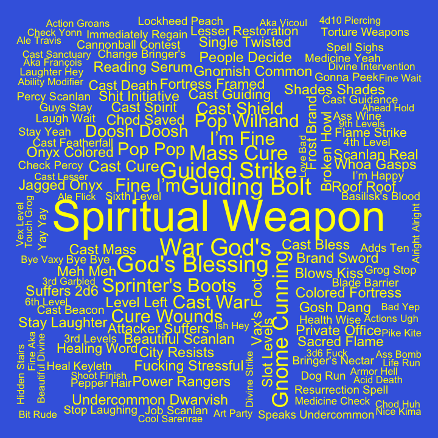
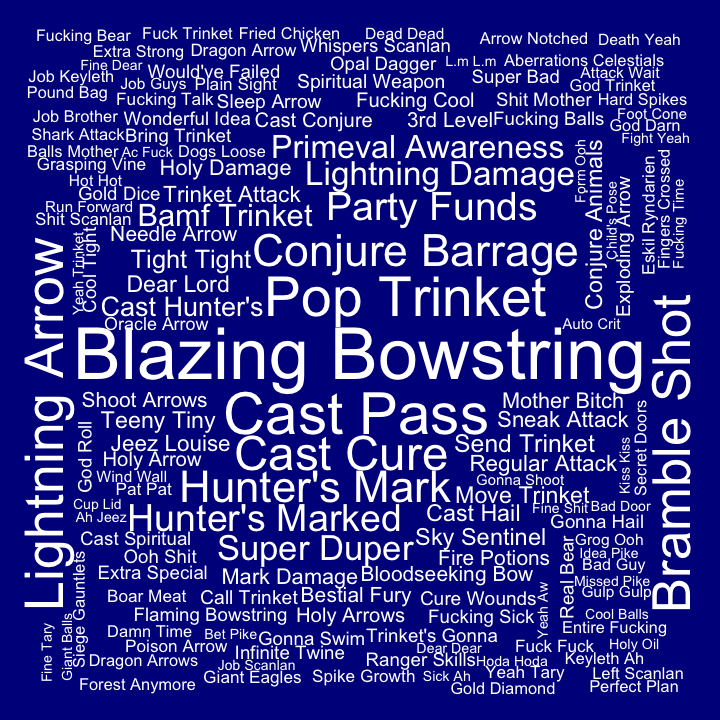
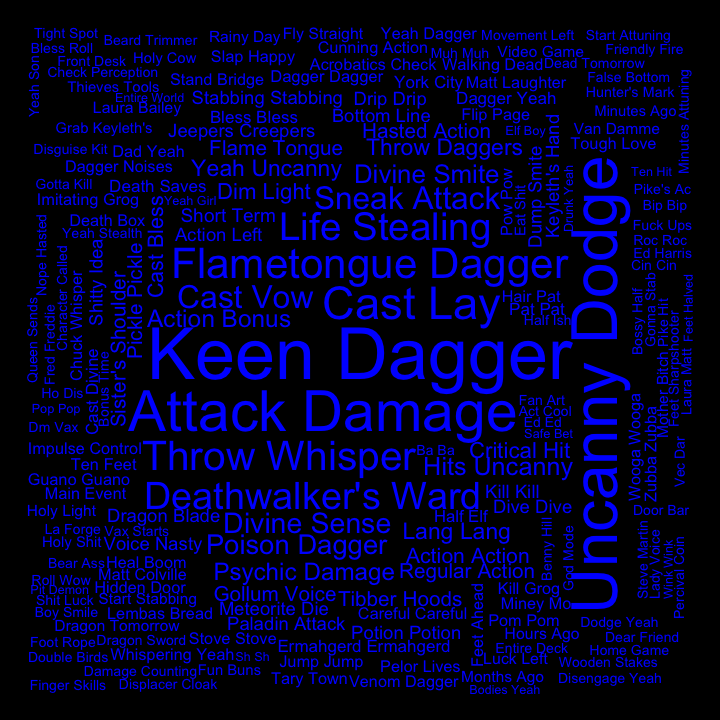
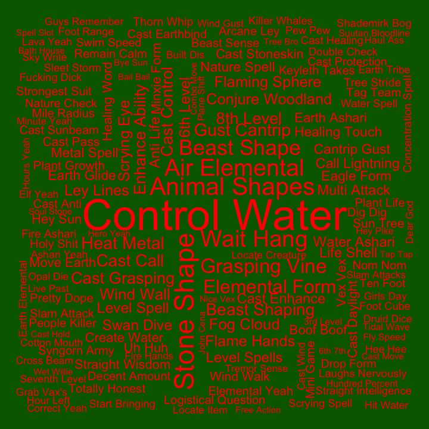
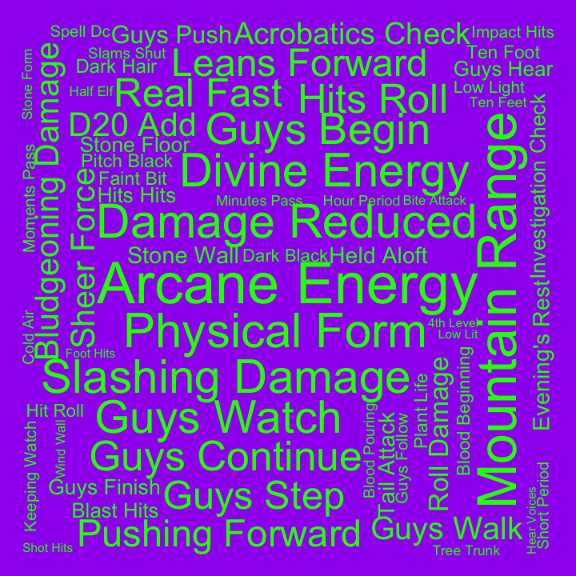
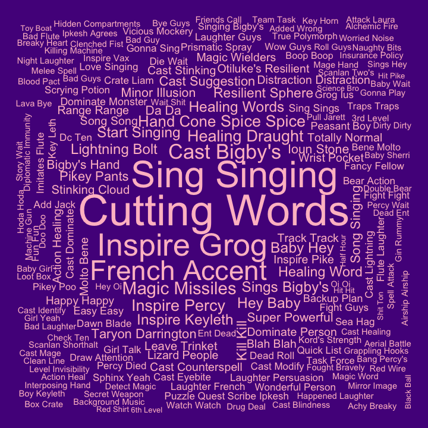
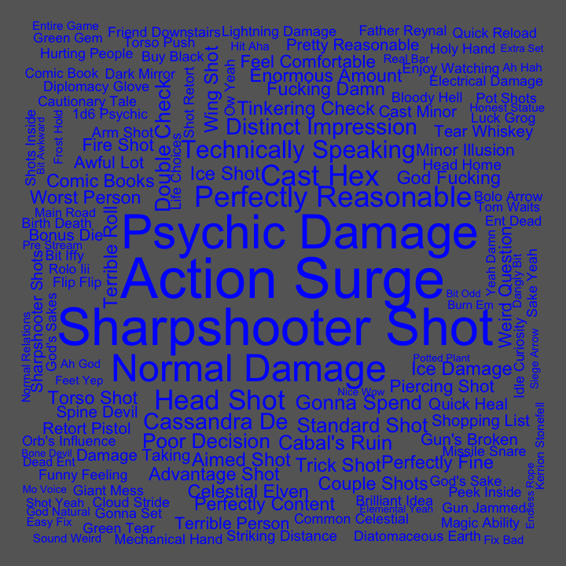
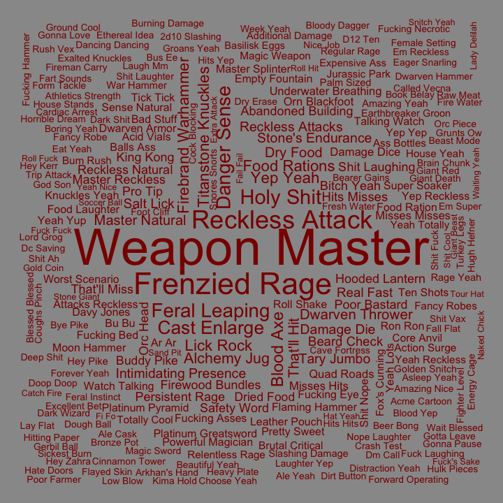

## Bigrams for C1

Pairs of words, bigrams, were analyzed. Bigrams containing stopwords or
digits were dropped, and bigrams were ranked by how unique they were to
each cast member, using tf-idf.

#### Ashley

| rank | bigram           |
|-----:|:-----------------|
|    1 | spiritual weapon |
|    2 | war god’s        |
|    3 | guiding bolt     |
|    4 | god’s blessing   |
|    5 | guided strike    |
|    6 | gnome cunning    |
|    7 | mass cure        |
|    8 | sprinter’s boots |
|    9 | cast war         |
|   10 | fine i’m         |

#### Laura

| rank | bigram            |
|-----:|:------------------|
|    1 | blazing bowstring |
|    2 | cast pass         |
|    3 | pop trinket       |
|    4 | lightning arrow   |
|    5 | bramble shot      |
|    6 | cast cure         |
|    7 | conjure barrage   |
|    8 | hunter’s mark     |
|    9 | party funds       |
|   10 | hunter’s marked   |

#### Liam

| rank | bigram             |
|-----:|:-------------------|
|    1 | keen dagger        |
|    2 | uncanny dodge      |
|    3 | attack damage      |
|    4 | cast lay           |
|    5 | flametongue dagger |
|    6 | throw whisper      |
|    7 | life stealing      |
|    8 | deathwalker’s ward |
|    9 | cast vow           |
|   10 | sneak attack       |

#### Marisha

| rank | bigram         |
|-----:|:---------------|
|    1 | control water  |
|    2 | stone shape    |
|    3 | animal shapes  |
|    4 | air elemental  |
|    5 | wait hang      |
|    6 | beast shape    |
|    7 | grasping vine  |
|    8 | elemental form |
|    9 | gust cantrip   |
|   10 | heat metal     |

#### Matt

| rank | bigram          |
|-----:|:----------------|
|    1 | arcane energy   |
|    2 | mountain range  |
|    3 | physical form   |
|    4 | slashing damage |
|    5 | divine energy   |
|    6 | damage reduced  |
|    7 | guys watch      |
|    8 | guys begin      |
|    9 | guys continue   |
|   10 | real fast       |

#### Sam

| rank | bigram          |
|-----:|:----------------|
|    1 | cutting words   |
|    2 | sing singing    |
|    3 | inspire grog    |
|    4 | french accent   |
|    5 | cast bigby’s    |
|    6 | magic missiles  |
|    7 | healing draught |
|    8 | inspire percy   |
|    9 | hand cone       |
|   10 | inspire keyleth |

#### Taliesin

| rank | bigram               |
|-----:|:---------------------|
|    1 | action surge         |
|    2 | sharpshooter shot    |
|    3 | psychic damage       |
|    4 | normal damage        |
|    5 | perfectly reasonable |
|    6 | cast hex             |
|    7 | head shot            |
|    8 | technically speaking |
|    9 | cassandra de         |
|   10 | distinct impression  |

#### Travis

| rank | bigram              |
|-----:|:--------------------|
|    1 | weapon master       |
|    2 | frenzied rage       |
|    3 | reckless attack     |
|    4 | holy shit           |
|    5 | danger sense        |
|    6 | feral leaping       |
|    7 | buddy pike          |
|    8 | cast enlarge        |
|    9 | blood axe           |
|   10 | titanstone knuckles |
