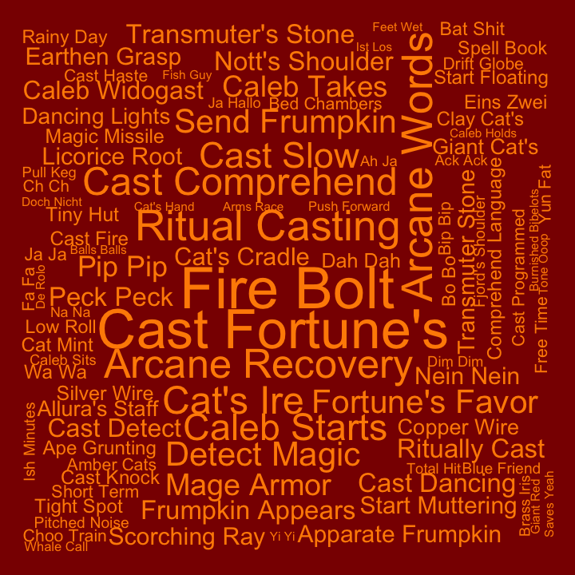
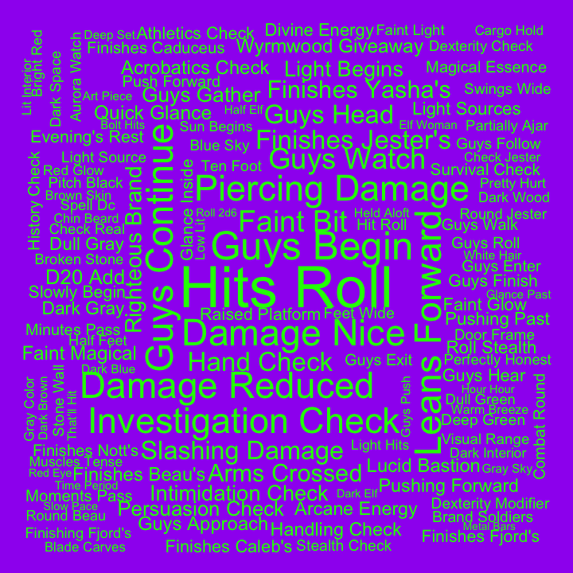

## Bigrams for C2

Pairs of words, bigrams, were analyzed. Bigrams containing stopwords or
digits were dropped, and bigrams were ranked by how unique they were to
each cast member, using tf-idf.

#### Ashley

| rank | bigram           |
|-----:|:-----------------|
|    1 | savage attacker  |
|    2 | um um            |
|    3 | zealous presence |
|    4 | healing hands    |
|    5 | divine fury      |
|    6 | holy avenger     |
|    7 | battle cry       |
|    8 | dah dah          |
|    9 | kay kay          |
|   10 | holy moly        |

#### Laura

| rank | bigram           |
|-----:|:-----------------|
|    1 | cast spiritual   |
|    2 | invoke duplicity |
|    3 | cast inflict     |
|    4 | cast sending     |
|    5 | cast guiding     |
|    6 | inflict wounds   |
|    7 | super duper      |
|    8 | hellish rebuke   |
|    9 | cast enhance     |
|   10 | locate object    |

#### Liam

| rank | bigram               |
|-----:|:---------------------|
|    1 | fire bolt            |
|    2 | cast fortune’s       |
|    3 | comprehend languages |
|    4 | arcane words         |
|    5 | ritual casting       |
|    6 | arcane recovery      |
|    7 | cast comprehend      |
|    8 | cat’s ire            |
|    9 | caleb starts         |
|   10 | cast slow            |

#### Marisha

| rank | bigram           |
|-----:|:-----------------|
|    1 | stunning strike  |
|    2 | patient defense  |
|    3 | deflect missiles |
|    4 | yeah laughs      |
|    5 | lucky jade       |
|    6 | pop pop          |
|    7 | quick scan       |
|    8 | totally honest   |
|    9 | deep speech      |
|   10 | cobalt reserve   |

#### Matt

| rank | bigram              |
|-----:|:--------------------|
|    1 | hits roll           |
|    2 | guys begin          |
|    3 | guys continue       |
|    4 | damage nice         |
|    5 | leans forward       |
|    6 | damage reduced      |
|    7 | piercing damage     |
|    8 | investigation check |
|    9 | faint bit           |
|   10 | guys watch          |

#### Sam

| rank | bigram             |
|-----:|:-------------------|
|    1 | action hide        |
|    2 | silent image       |
|    3 | cast phantasmal    |
|    4 | cast silent        |
|    5 | brenatto’s voltaic |
|    6 | cast mage          |
|    7 | voltaic bolt       |
|    8 | cast brenatto’s    |
|    9 | cast message       |
|   10 | action disengage   |

#### Taliesin

| rank | bigram          |
|-----:|:----------------|
|    1 | vicious mockery |
|    2 | funny feeling   |
|    3 | detect undead   |
|    4 | sacred flame    |
|    5 | blood maledict  |
|    6 | detect magic    |
|    7 | cast bless      |
|    8 | cast bane       |
|    9 | light spell     |
|   10 | mass healing    |

#### Travis

| rank | bigram          |
|-----:|:----------------|
|    1 | eldritch blasts |
|    2 | star razor      |
|    3 | celestial fiend |
|    4 | cast hexblade’s |
|    5 | divine sense    |
|    6 | slashing damage |
|    7 | divine smite    |
|    8 | cast hex        |
|    9 | relentless hex  |
|   10 | blast damage    |
