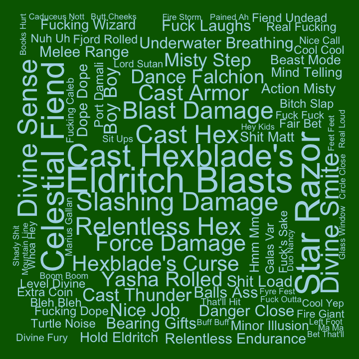

## Bigrams for C2

Pairs of words, bigrams, were analyzed. Bigrams containing stopwords or
digits were dropped, and bigrams were ranked by how unique they were to
each cast member, using tf-idf.

#### Ashley

| rank | bigram           |
|-----:|:-----------------|
|    1 | savage attacker  |
|    2 | healing hands    |
|    3 | um um            |
|    4 | divine fury      |
|    5 | kay kay          |
|    6 | zealous presence |
|    7 | dah dah          |
|    8 | holy avenger     |
|    9 | wha wha          |
|   10 | battle cry       |

#### Laura

| rank | bigram           |
|-----:|:-----------------|
|    1 | cast spiritual   |
|    2 | invoke duplicity |
|    3 | cast inflict     |
|    4 | cast sending     |
|    5 | inflict wounds   |
|    6 | cast guiding     |
|    7 | hellish rebuke   |
|    8 | blink blink      |
|    9 | super duper      |
|   10 | cast cure        |

#### Liam

| rank | bigram               |
|-----:|:---------------------|
|    1 | fire bolt            |
|    2 | comprehend languages |
|    3 | ritual casting       |
|    4 | arcane recovery      |
|    5 | cast fortune’s       |
|    6 | cast comprehend      |
|    7 | cast slow            |
|    8 | detect magic         |
|    9 | arcane words         |
|   10 | caleb starts         |

#### Marisha

| rank | bigram           |
|-----:|:-----------------|
|    1 | stunning strike  |
|    2 | patient defense  |
|    3 | deflect missiles |
|    4 | yeah laughs      |
|    5 | deep speech      |
|    6 | quick scan       |
|    7 | pop pop          |
|    8 | dodge action     |
|    9 | fucking punch    |
|   10 | lucky jade       |

#### Matt

| rank | bigram              |
|-----:|:--------------------|
|    1 | hits roll           |
|    2 | roll damage         |
|    3 | investigation check |
|    4 | persuasion check    |
|    5 | piercing damage     |
|    6 | damage reduced      |
|    7 | damage nice         |
|    8 | guys continue       |
|    9 | guys begin          |
|   10 | faint bit           |

#### Sam

| rank | bigram             |
|-----:|:-------------------|
|    1 | action hide        |
|    2 | action disengage   |
|    3 | voltaic bolt       |
|    4 | cast phantasmal    |
|    5 | silent image       |
|    6 | cast silent        |
|    7 | cast mage          |
|    8 | brenatto’s voltaic |
|    9 | attack damage      |
|   10 | uncanny dodge      |

#### Taliesin

| rank | bigram           |
|-----:|:-----------------|
|    1 | vicious mockery  |
|    2 | detect undead    |
|    3 | sacred flame     |
|    4 | blood maledict   |
|    5 | detect magic     |
|    6 | funny feeling    |
|    7 | cast bane        |
|    8 | light spell      |
|    9 | spirit guardians |
|   10 | cast light       |

#### Travis

| rank | bigram          |
|-----:|:----------------|
|    1 | blast damage    |
|    2 | eldritch blasts |
|    3 | celestial fiend |
|    4 | star razor      |
|    5 | cast hexblade’s |
|    6 | slashing damage |
|    7 | divine sense    |
|    8 | cast hex        |
|    9 | yasha rolled    |
|   10 | cast armor      |
