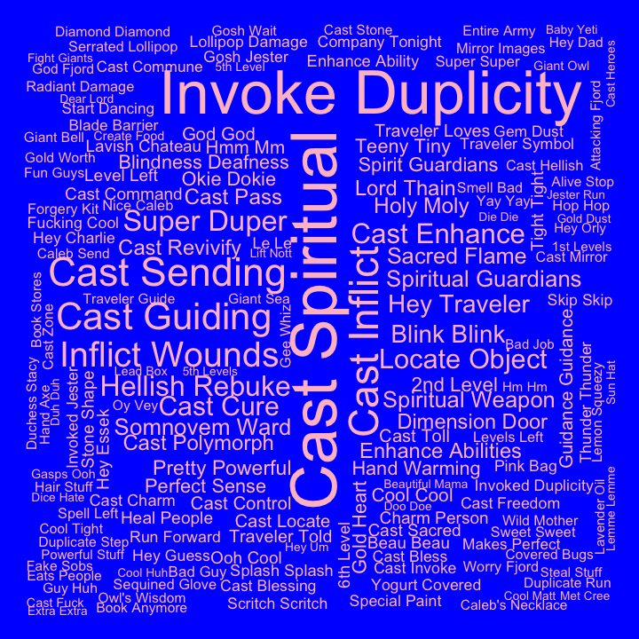
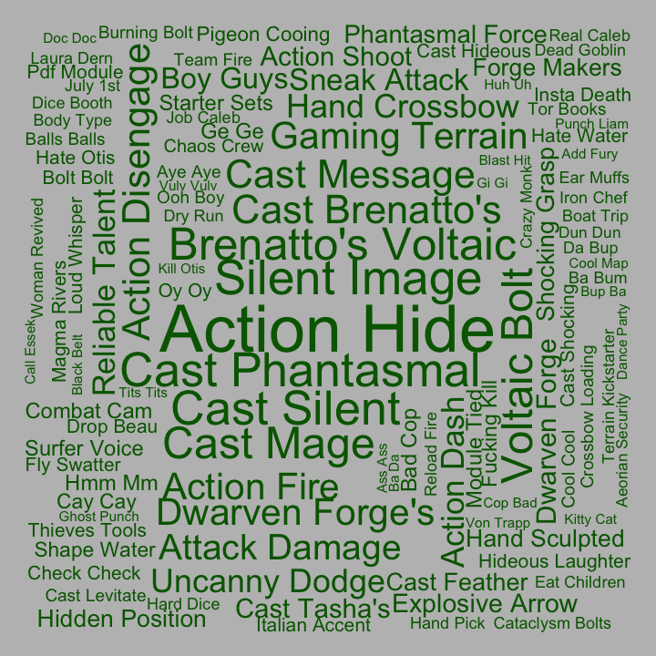

## Bigrams for C2

Pairs of words, bigrams, were analyzed. Bigrams containing stopwords or
digits were dropped, and bigrams were ranked by how unique they were to
each cast member, using tf-idf.

#### Ashley

| rank | bigram           |
|-----:|:-----------------|
|    1 | healing hands    |
|    2 | savage attacker  |
|    3 | um um            |
|    4 | divine fury      |
|    5 | kay kay          |
|    6 | zealous presence |
|    7 | dah dah          |
|    8 | wha wha          |
|    9 | holy avenger     |
|   10 | battle cry       |

#### Laura

| rank | bigram           |
|-----:|:-----------------|
|    1 | cast spiritual   |
|    2 | invoke duplicity |
|    3 | cast inflict     |
|    4 | cast sending     |
|    5 | inflict wounds   |
|    6 | cast guiding     |
|    7 | hellish rebuke   |
|    8 | blink blink      |
|    9 | super duper      |
|   10 | cast cure        |

#### Liam

| rank | bigram               |
|-----:|:---------------------|
|    1 | fire bolt            |
|    2 | comprehend languages |
|    3 | ritual casting       |
|    4 | arcane recovery      |
|    5 | cast comprehend      |
|    6 | cast fortune’s       |
|    7 | cast slow            |
|    8 | detect magic         |
|    9 | arcane words         |
|   10 | caleb starts         |

#### Marisha

| rank | bigram           |
|-----:|:-----------------|
|    1 | stunning strike  |
|    2 | patient defense  |
|    3 | deflect missiles |
|    4 | deep speech      |
|    5 | yeah laughs      |
|    6 | pop pop          |
|    7 | dodge action     |
|    8 | fucking punch    |
|    9 | lucky jade       |
|   10 | quick scan       |

#### Matt

| rank | bigram              |
|-----:|:--------------------|
|    1 | hits roll           |
|    2 | persuasion check    |
|    3 | roll damage         |
|    4 | investigation check |
|    5 | piercing damage     |
|    6 | damage reduced      |
|    7 | damage nice         |
|    8 | guys continue       |
|    9 | guys begin          |
|   10 | faint bit           |

#### Sam

| rank | bigram             |
|-----:|:-------------------|
|    1 | action hide        |
|    2 | action disengage   |
|    3 | cast phantasmal    |
|    4 | silent image       |
|    5 | cast silent        |
|    6 | voltaic bolt       |
|    7 | cast mage          |
|    8 | attack damage      |
|    9 | brenatto’s voltaic |
|   10 | uncanny dodge      |

#### Taliesin

| rank | bigram           |
|-----:|:-----------------|
|    1 | vicious mockery  |
|    2 | detect undead    |
|    3 | sacred flame     |
|    4 | blood maledict   |
|    5 | detect magic     |
|    6 | funny feeling    |
|    7 | cast bane        |
|    8 | light spell      |
|    9 | spirit guardians |
|   10 | cast light       |

#### Travis

| rank | bigram          |
|-----:|:----------------|
|    1 | blast damage    |
|    2 | celestial fiend |
|    3 | eldritch blasts |
|    4 | star razor      |
|    5 | cast hexblade’s |
|    6 | slashing damage |
|    7 | cast hex        |
|    8 | divine sense    |
|    9 | yasha rolled    |
|   10 | cast armor      |
