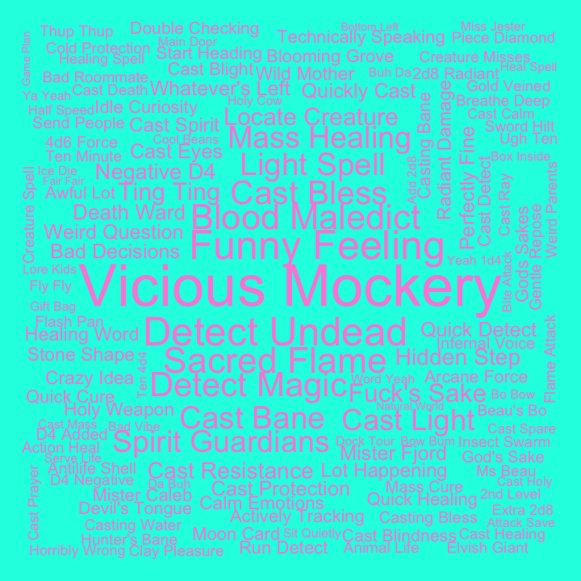

## Bigrams for C2

Pairs of words, bigrams, were analyzed. Bigrams containing stopwords or
digits were dropped, and bigrams were ranked by how unique they were to
each cast member, using tf-idf.

#### Ashley

| rank | bigram           |
|-----:|:-----------------|
|    1 | savage attacker  |
|    2 | healing hands    |
|    3 | um um            |
|    4 | divine fury      |
|    5 | kay kay          |
|    6 | zealous presence |
|    7 | dah dah          |
|    8 | holy avenger     |
|    9 | wha wha          |
|   10 | battle cry       |

#### Laura

| rank | bigram           |
|-----:|:-----------------|
|    1 | cast spiritual   |
|    2 | invoke duplicity |
|    3 | cast inflict     |
|    4 | cast sending     |
|    5 | cast guiding     |
|    6 | inflict wounds   |
|    7 | hellish rebuke   |
|    8 | cast cure        |
|    9 | blink blink      |
|   10 | super duper      |

#### Liam

| rank | bigram               |
|-----:|:---------------------|
|    1 | fire bolt            |
|    2 | comprehend languages |
|    3 | ritual casting       |
|    4 | arcane recovery      |
|    5 | cast fortune’s       |
|    6 | cast comprehend      |
|    7 | cast slow            |
|    8 | detect magic         |
|    9 | arcane words         |
|   10 | caleb starts         |

#### Marisha

| rank | bigram           |
|-----:|:-----------------|
|    1 | stunning strike  |
|    2 | patient defense  |
|    3 | deflect missiles |
|    4 | yeah laughs      |
|    5 | deep speech      |
|    6 | pop pop          |
|    7 | quick scan       |
|    8 | dodge action     |
|    9 | sentinel attack  |
|   10 | fucking punch    |

#### Matt

| rank | bigram              |
|-----:|:--------------------|
|    1 | hits roll           |
|    2 | persuasion check    |
|    3 | investigation check |
|    4 | piercing damage     |
|    5 | damage reduced      |
|    6 | damage nice         |
|    7 | guys continue       |
|    8 | guys begin          |
|    9 | faint bit           |
|   10 | hand check          |

#### Sam

| rank | bigram             |
|-----:|:-------------------|
|    1 | action hide        |
|    2 | action disengage   |
|    3 | voltaic bolt       |
|    4 | cast phantasmal    |
|    5 | silent image       |
|    6 | cast silent        |
|    7 | cast mage          |
|    8 | brenatto’s voltaic |
|    9 | attack damage      |
|   10 | action fire        |

#### Taliesin

| rank | bigram           |
|-----:|:-----------------|
|    1 | vicious mockery  |
|    2 | detect undead    |
|    3 | sacred flame     |
|    4 | blood maledict   |
|    5 | funny feeling    |
|    6 | detect magic     |
|    7 | cast bane        |
|    8 | light spell      |
|    9 | spirit guardians |
|   10 | cast light       |

#### Travis

| rank | bigram          |
|-----:|:----------------|
|    1 | blast damage    |
|    2 | eldritch blasts |
|    3 | celestial fiend |
|    4 | star razor      |
|    5 | cast hexblade’s |
|    6 | slashing damage |
|    7 | divine sense    |
|    8 | cast hex        |
|    9 | yasha rolled    |
|   10 | cast armor      |
