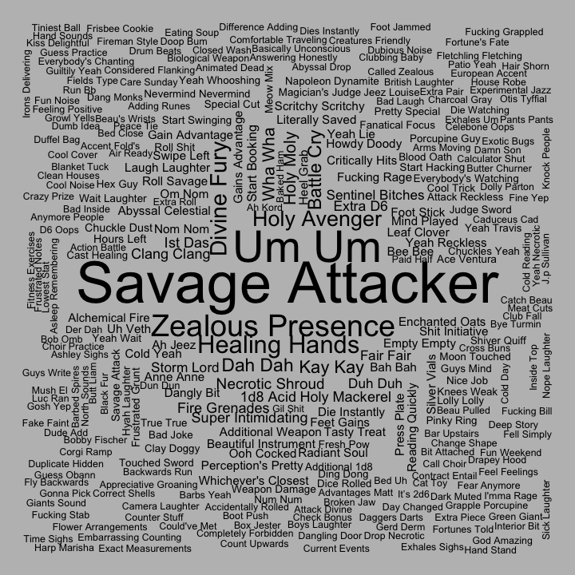
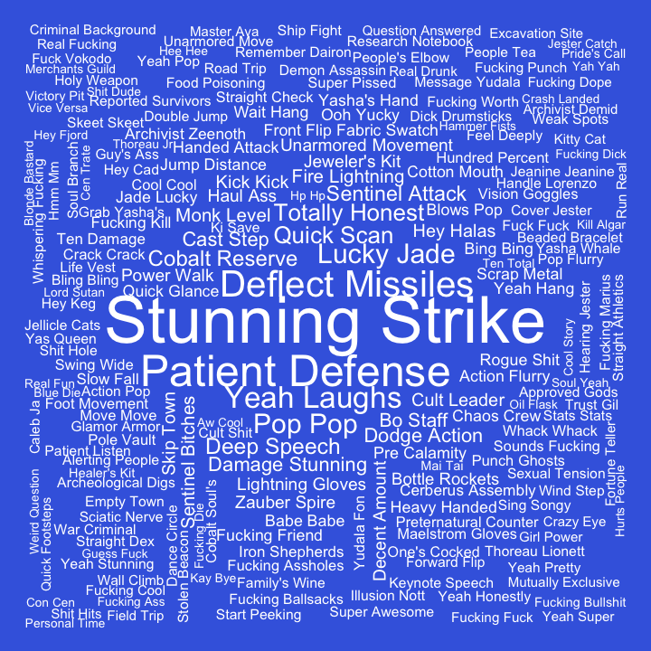

## Bigrams for C2

Pairs of words, bigrams, were analyzed. Bigrams containing stopwords or
digits were dropped, and bigrams were ranked by how unique they were to
each cast member, using tf-idf.

#### Ashley

| rank | bigram           |
|-----:|:-----------------|
|    1 | healing hands    |
|    2 | um um            |
|    3 | divine fury      |
|    4 | savage attacker  |
|    5 | kay kay          |
|    6 | dah dah          |
|    7 | wha wha          |
|    8 | zealous presence |
|    9 | bee bee          |
|   10 | ist das          |

#### Laura

| rank | bigram           |
|-----:|:-----------------|
|    1 | cast spiritual   |
|    2 | invoke duplicity |
|    3 | cast inflict     |
|    4 | cast sending     |
|    5 | inflict wounds   |
|    6 | cast guiding     |
|    7 | hellish rebuke   |
|    8 | blink blink      |
|    9 | super duper      |
|   10 | cast cure        |

#### Liam

| rank | bigram               |
|-----:|:---------------------|
|    1 | fire bolt            |
|    2 | fortune’s favor      |
|    3 | comprehend languages |
|    4 | ritual casting       |
|    5 | arcane recovery      |
|    6 | cast slow            |
|    7 | arcane words         |
|    8 | cast fortune’s       |
|    9 | caleb starts         |
|   10 | detect magic         |

#### Marisha

| rank | bigram           |
|-----:|:-----------------|
|    1 | stunning strike  |
|    2 | patient defense  |
|    3 | deflect missiles |
|    4 | deep speech      |
|    5 | yeah laughs      |
|    6 | pop pop          |
|    7 | dodge action     |
|    8 | fucking punch    |
|    9 | quick scan       |
|   10 | totally honest   |

#### Matt

| rank | bigram              |
|-----:|:--------------------|
|    1 | roll damage         |
|    2 | hits roll           |
|    3 | persuasion check    |
|    4 | investigation check |
|    5 | piercing damage     |
|    6 | guys continue       |
|    7 | damage nice         |
|    8 | damage reduced      |
|    9 | guys begin          |
|   10 | hand check          |

#### Sam

| rank | bigram             |
|-----:|:-------------------|
|    1 | action hide        |
|    2 | action disengage   |
|    3 | cast phantasmal    |
|    4 | voltaic bolt       |
|    5 | silent image       |
|    6 | cast silent        |
|    7 | cast mage          |
|    8 | brenatto’s voltaic |
|    9 | attack damage      |
|   10 | uncanny dodge      |

#### Taliesin

| rank | bigram           |
|-----:|:-----------------|
|    1 | vicious mockery  |
|    2 | detect undead    |
|    3 | blood maledict   |
|    4 | sacred flame     |
|    5 | detect magic     |
|    6 | funny feeling    |
|    7 | cast bane        |
|    8 | light spell      |
|    9 | spirit guardians |
|   10 | cast light       |

#### Travis

| rank | bigram          |
|-----:|:----------------|
|    1 | blast damage    |
|    2 | eldritch blasts |
|    3 | star razor      |
|    4 | cast hexblade’s |
|    5 | celestial fiend |
|    6 | slashing damage |
|    7 | cast hex        |
|    8 | divine sense    |
|    9 | yasha rolled    |
|   10 | cast armor      |
