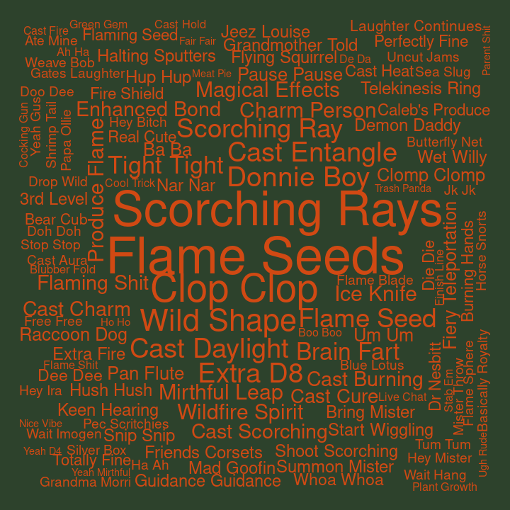
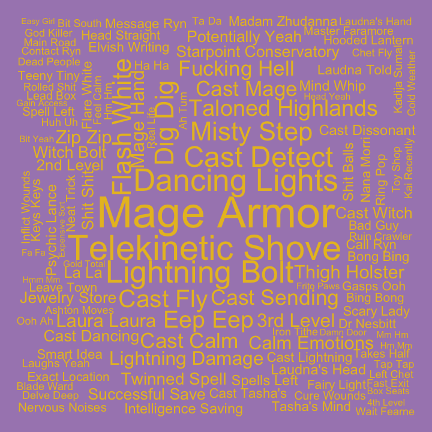
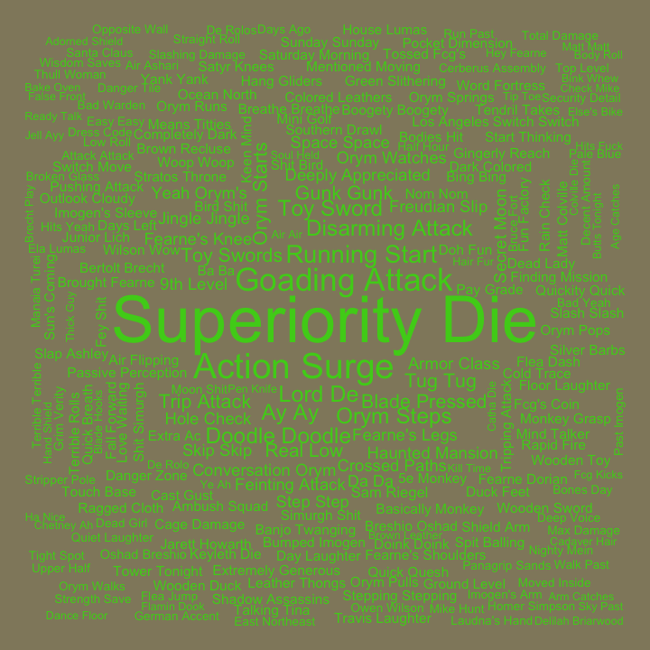
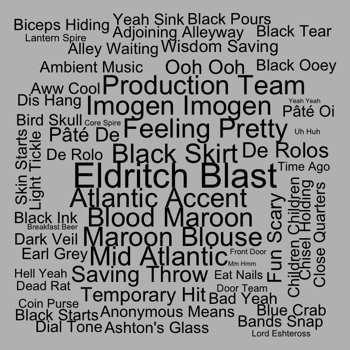
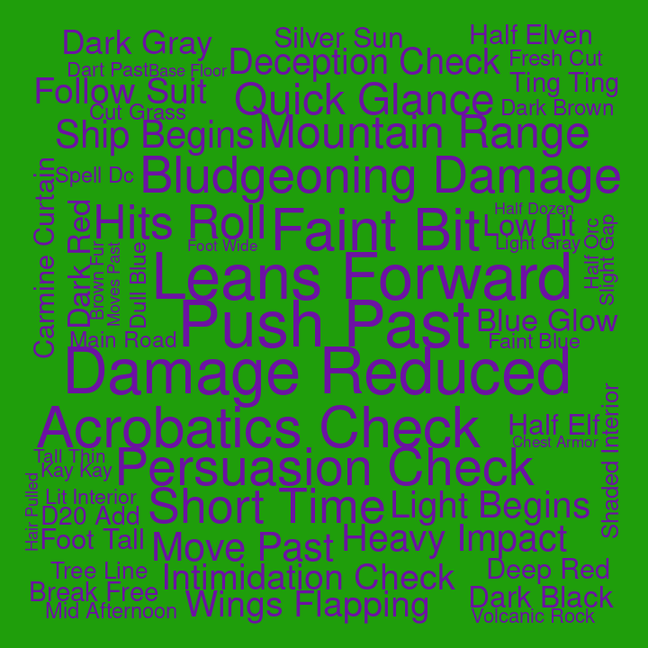
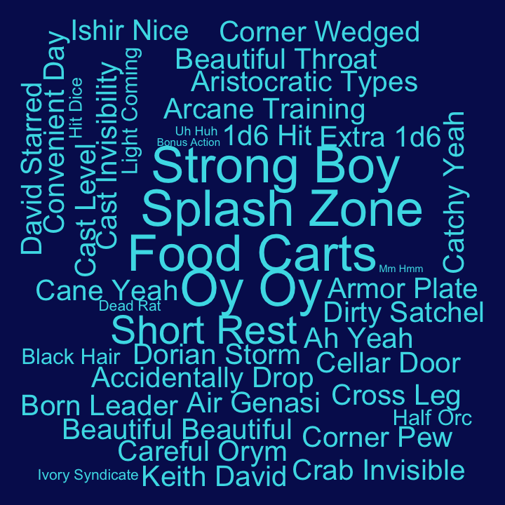
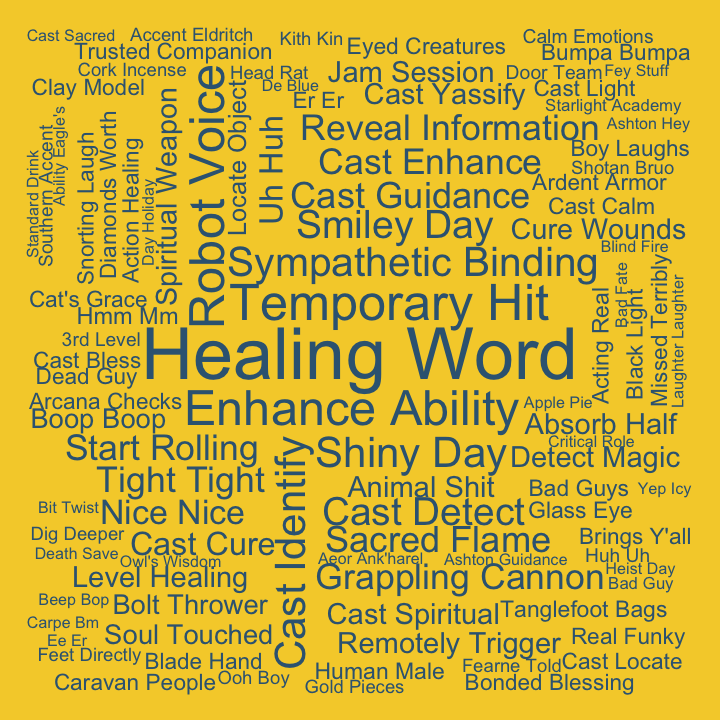
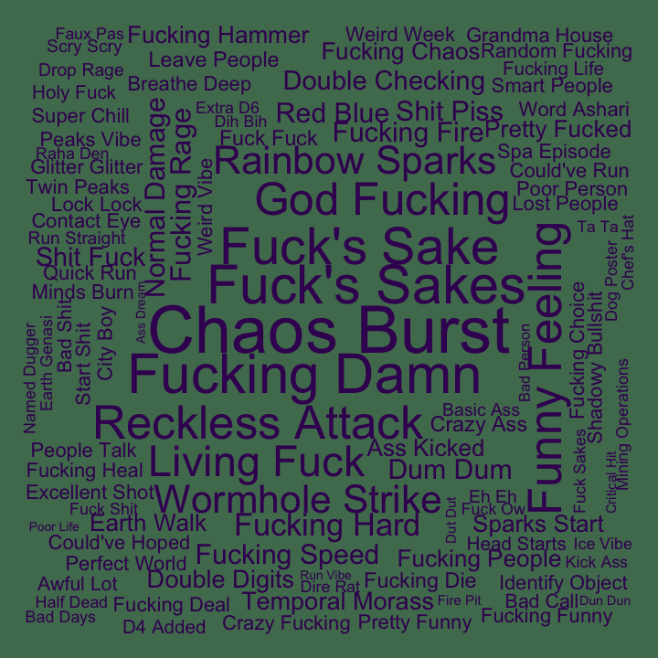
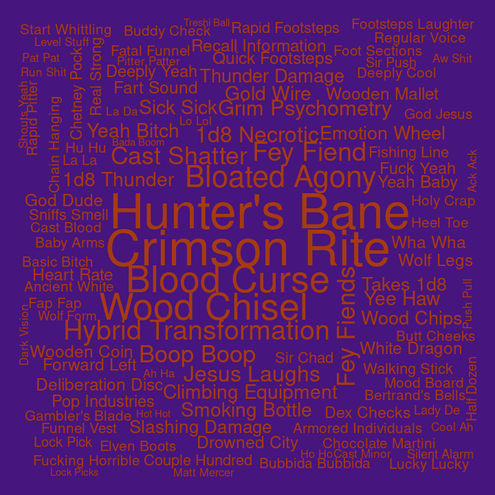

## Bigrams for C3

Pairs of words, bigrams, were analyzed. Bigrams containing stopwords or
digits were dropped, and bigrams were ranked by how unique they were to
each cast member, using tf-idf.

#### Ashley

| rank | bigram            |
| ---: | :---------------- |
|    1 | wild shape        |
|    2 | wildfire spirit   |
|    3 | cast burning      |
|    4 | flame seed        |
|    5 | burning hands     |
|    6 | bite attack       |
|    7 | constrictor snake |
|    8 | dink dink         |
|    9 | dr nesbitt        |
|   10 | feels weird       |

#### Laura

| rank | bigram            |
| ---: | :---------------- |
|    1 | laura laura       |
|    2 | cast witch        |
|    3 | telekinetic shove |
|    4 | mage armor        |
|    5 | psychic damage    |
|    6 | witch bolt        |
|    7 | dancing lights    |
|    8 | madam zhudanna    |
|    9 | multiple people   |
|   10 | taloned highlands |

#### Liam

| rank | bigram             |
| ---: | :----------------- |
|    1 | running start      |
|    2 | action surge       |
|    3 | goading attack     |
|    4 | strength save      |
|    5 | gunk gunk          |
|    6 | superiority die    |
|    7 | deeply appreciated |
|    8 | jingle jingle      |
|    9 | keen mind          |
|   10 | bird shit          |

#### Marisha

| rank | bigram              |
| ---: | :------------------ |
|    1 | creepy whispering   |
|    2 | eldritch blast      |
|    3 | fuck fuck           |
|    4 | rock chisel         |
|    5 | la la               |
|    6 | unsettling presence |
|    7 | temporary hit       |
|    8 | uh huh              |
|    9 | wisdom saving       |
|   10 | false life          |

#### Matt

| rank | bigram              |
| ---: | :------------------ |
|    1 | persuasion check    |
|    2 | roll damage         |
|    3 | investigation check |
|    4 | perception check    |
|    5 | fire damage         |
|    6 | dexterity saving    |
|    7 | stealth check       |
|    8 | deception check     |
|    9 | piercing damage     |
|   10 | hand check          |

#### Robbie

| rank | bigram           |
| ---: | :--------------- |
|    1 | cure wounds      |
|    2 | beep boop        |
|    3 | boing boing      |
|    4 | cast level       |
|    5 | rhythm section   |
|    6 | cast cure        |
|    7 | moon touched     |
|    8 | touched scimitar |
|    9 | charm person     |
|   10 | orchestra pit    |

#### Sam

| rank | bigram           |
| ---: | :--------------- |
|    1 | robot voice      |
|    2 | healing word     |
|    3 | cast guidance    |
|    4 | enhance ability  |
|    5 | shiny day        |
|    6 | smiley day       |
|    7 | temporary hit    |
|    8 | animal shit      |
|    9 | cast enhance     |
|   10 | grappling cannon |

#### Taliesin

| rank | bigram           |
| ---: | :--------------- |
|    1 | chaos burst      |
|    2 | fuck’s sake      |
|    3 | weird fucking    |
|    4 | reckless attack  |
|    5 | normal damage    |
|    6 | yep yep          |
|    7 | lightning damage |
|    8 | earth genasi     |
|    9 | force damage     |
|   10 | grandma house    |

#### Travis

| rank | bigram            |
| ---: | :---------------- |
|    1 | bertrand’s bells  |
|    2 | sorcerous swords  |
|    3 | tight quarters    |
|    4 | yesterday morning |
|    5 | chanting level    |
|    6 | gambler’s blade   |
|    7 | bookcase moves    |
|    8 | ca caw            |
|    9 | close calls       |
|   10 | excited noise     |
