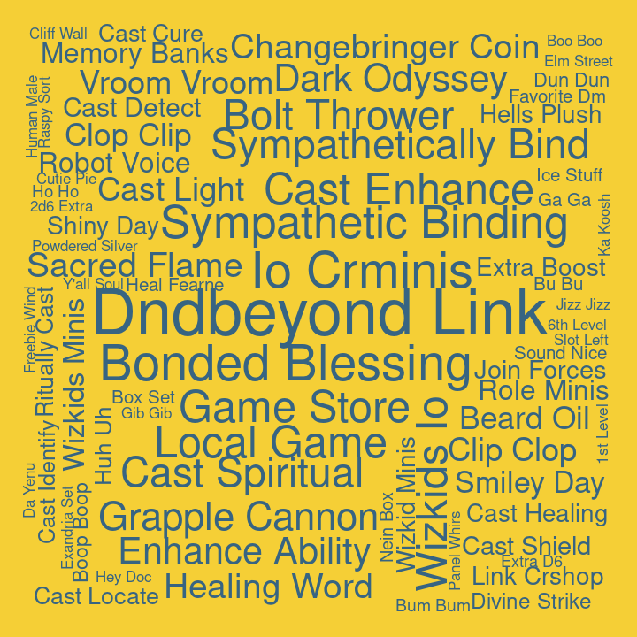

## Bigrams for C3

Pairs of words, bigrams, were analyzed. Bigrams containing stopwords or
digits were dropped, and bigrams were ranked by how unique they were to
each cast member, using tf-idf.

#### Ashley

| rank | bigram          |
| ---: | :-------------- |
|    1 | flame seeds     |
|    2 | scorching rays  |
|    3 | wild shape      |
|    4 | cast entangle   |
|    5 | flame seed      |
|    6 | whoa whoa       |
|    7 | wildfire spirit |
|    8 | dee dee         |
|    9 | moon sickle     |
|   10 | ice knife       |

#### Laura

| rank | bigram            |
| ---: | :---------------- |
|    1 | mage armor        |
|    2 | telekinetic shove |
|    3 | lightning bolt    |
|    4 | dancing lights    |
|    5 | cast detect       |
|    6 | misty step        |
|    7 | dig dig           |
|    8 | eep eep           |
|    9 | flash white       |
|   10 | cast fly          |

#### Liam

| rank | bigram           |
| ---: | :--------------- |
|    1 | superiority die  |
|    2 | goading attack   |
|    3 | action surge     |
|    4 | grasping vine    |
|    5 | pushing attack   |
|    6 | orym starts      |
|    7 | running start    |
|    8 | ay ay            |
|    9 | dead lady        |
|   10 | disarming attack |

#### Marisha

| rank | bigram              |
| ---: | :------------------ |
|    1 | eldritch blast      |
|    2 | demonic whispers    |
|    3 | dream journal       |
|    4 | unsettling presence |
|    5 | silvery barbs       |
|    6 | creepy whispering   |
|    7 | roll ability        |
|    8 | tickle tickle       |
|    9 | mirror image        |
|   10 | rock chisel         |

#### Matt

| rank | bigram              |
| ---: | :------------------ |
|    1 | acrobatics check    |
|    2 | roll damage         |
|    3 | persuasion check    |
|    4 | push past           |
|    5 | piercing damage     |
|    6 | leans forward       |
|    7 | short time          |
|    8 | bludgeoning damage  |
|    9 | move past           |
|   10 | investigation check |

#### Sam

| rank | bigram              |
| ---: | :------------------ |
|    1 | healing word        |
|    2 | game store          |
|    3 | local game          |
|    4 | wizkids.io crminis  |
|    5 | cure wounds         |
|    6 | bolt thrower        |
|    7 | bonded blessing     |
|    8 | sympathetic binding |
|    9 | enhance ability     |
|   10 | bow bow             |

#### Taliesin

| rank | bigram          |
| ---: | :-------------- |
|    1 | chaos burst     |
|    2 | fuck’s sake     |
|    3 | reckless attack |
|    4 | god fucking     |
|    5 | fuck’s sakes    |
|    6 | fucking damn    |
|    7 | funny feeling   |
|    8 | shit fuck       |
|    9 | fucking hard    |
|   10 | living fuck     |

#### Travis

| rank | bigram             |
| ---: | :----------------- |
|    1 | wood chisel        |
|    2 | crimson rite       |
|    3 | hunter’s bane      |
|    4 | slashing damage    |
|    5 | blood curse        |
|    6 | 1d8 necrotic       |
|    7 | climbing equipment |
|    8 | gold wire          |
|    9 | sick sick          |
|   10 | smoking bottle     |
