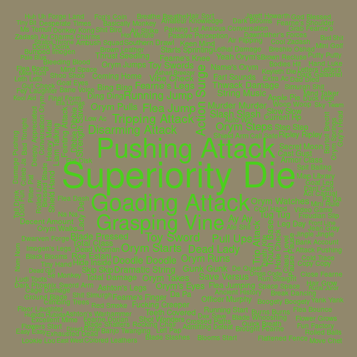
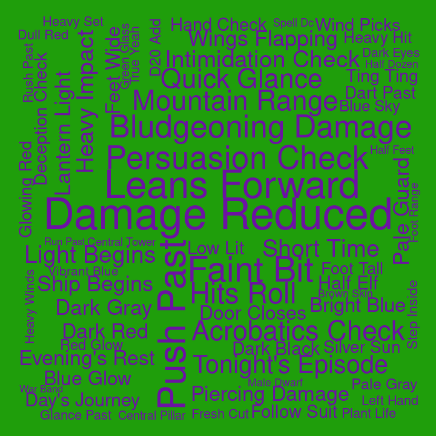

## Bigrams for C3

Pairs of words, bigrams, were analyzed. Bigrams containing stopwords or
digits were dropped, and bigrams were ranked by how unique they were to
each cast member, using tf-idf.

#### Ashley

| rank | bigram          |
|-----:|:----------------|
|    1 | cast burning    |
|    2 | wild shape      |
|    3 | burning hands   |
|    4 | jeez louise     |
|    5 | uh uh           |
|    6 | wildfire spirit |
|    7 | cast charm      |
|    8 | ice knife       |
|    9 | flame seed      |
|   10 | bite attack     |

#### Laura

| rank | bigram            |
|-----:|:------------------|
|    1 | laura laura       |
|    2 | witch bolt        |
|    3 | cast witch        |
|    4 | telekinetic shove |
|    5 | mage armor        |
|    6 | psychic damage    |
|    7 | cast detect       |
|    8 | dancing lights    |
|    9 | madam zhudanna    |
|   10 | multiple people   |

#### Liam

| rank | bigram             |
|-----:|:-------------------|
|    1 | action surge       |
|    2 | doodle doodle      |
|    3 | running start      |
|    4 | strength save      |
|    5 | goading attack     |
|    6 | gunk gunk          |
|    7 | superiority die    |
|    8 | deeply appreciated |
|    9 | jingle jingle      |
|   10 | keen mind          |

#### Marisha

| rank | bigram              |
|-----:|:--------------------|
|    1 | eldritch blast      |
|    2 | creepy whispering   |
|    3 | fuck fuck           |
|    4 | rock chisel         |
|    5 | la la               |
|    6 | unsettling presence |
|    7 | temporary hit       |
|    8 | wisdom saving       |
|    9 | uh huh              |
|   10 | false life          |

#### Matt

| rank | bigram              |
|-----:|:--------------------|
|    1 | persuasion check    |
|    2 | roll damage         |
|    3 | fire damage         |
|    4 | investigation check |
|    5 | dexterity saving    |
|    6 | perception check    |
|    7 | stealth check       |
|    8 | deception check     |
|    9 | piercing damage     |
|   10 | leans forward       |

#### Robbie

| rank | bigram           |
|-----:|:-----------------|
|    1 | cast level       |
|    2 | beep boop        |
|    3 | boing boing      |
|    4 | rhythm section   |
|    5 | cure wounds      |
|    6 | moon touched     |
|    7 | touched scimitar |
|    8 | orchestra pit    |
|    9 | cast cure        |
|   10 | air genasi       |

#### Sam

| rank | bigram          |
|-----:|:----------------|
|    1 | robot voice     |
|    2 | healing word    |
|    3 | cast guidance   |
|    4 | enhance ability |
|    5 | shiny day       |
|    6 | smiley day      |
|    7 | hmm mm          |
|    8 | temporary hit   |
|    9 | animal shit     |
|   10 | cast enhance    |

#### Taliesin

| rank | bigram           |
|-----:|:-----------------|
|    1 | chaos burst      |
|    2 | fuck’s sake      |
|    3 | reckless attack  |
|    4 | weird fucking    |
|    5 | yep yep          |
|    6 | normal damage    |
|    7 | lightning damage |
|    8 | earth genasi     |
|    9 | force damage     |
|   10 | grandma house    |

#### Travis

| rank | bigram            |
|-----:|:------------------|
|    1 | wood chisel       |
|    2 | bertrand’s bells  |
|    3 | sorcerous swords  |
|    4 | tight quarters    |
|    5 | yesterday morning |
|    6 | chanting level    |
|    7 | gambler’s blade   |
|    8 | bitch laughter    |
|    9 | ca caw            |
|   10 | close calls       |
