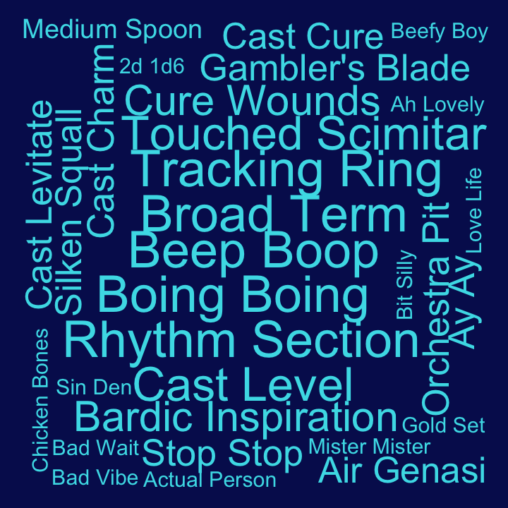

## Bigrams for C3

Pairs of words, bigrams, were analyzed. Bigrams containing stopwords or
digits were dropped, and bigrams were ranked by how unique they were to
each cast member, using tf-idf.

#### Ashley

| rank | bigram           |
| ---: | :--------------- |
|    1 | scorching rays   |
|    2 | flame seed       |
|    3 | wild shape       |
|    4 | cast burning     |
|    5 | um um            |
|    6 | whoa whoa        |
|    7 | wildfire spirit  |
|    8 | cast entangle    |
|    9 | grandmother told |
|   10 | hey mister       |

#### Laura

| rank | bigram           |
| ---: | :--------------- |
|    1 | dancing lights   |
|    2 | lightning damage |
|    3 | dig dig          |
|    4 | witch bolt       |
|    5 | flash white      |
|    6 | laura laura      |
|    7 | shit balls       |
|    8 | mage armor       |
|    9 | cast detect      |
|   10 | misty step       |

#### Liam

| rank | bigram          |
| ---: | :-------------- |
|    1 | superiority die |
|    2 | goading attack  |
|    3 | action surge    |
|    4 | doodle doodle   |
|    5 | running start   |
|    6 | real low        |
|    7 | gunk gunk       |
|    8 | tug tug         |
|    9 | strength save   |
|   10 | wisdom save     |

#### Marisha

| rank | bigram              |
| ---: | :------------------ |
|    1 | creepy whispering   |
|    2 | eldritch blast      |
|    3 | unsettling presence |
|    4 | dream journal       |
|    5 | rock chisel         |
|    6 | temporary hit       |
|    7 | spell sniper        |
|    8 | brilliant idea      |
|    9 | imogen coming       |
|   10 | roll ability        |

#### Matt

| rank | bigram              |
| ---: | :------------------ |
|    1 | persuasion check    |
|    2 | roll damage         |
|    3 | perception check    |
|    4 | dexterity saving    |
|    5 | hellcatch valley    |
|    6 | bludgeoning damage  |
|    7 | piercing damage     |
|    8 | investigation check |
|    9 | acrobatics check    |
|   10 | stealth check       |

#### Robbie

| rank | bigram             |
| ---: | :----------------- |
|    1 | beep boop          |
|    2 | boing boing        |
|    3 | broad term         |
|    4 | rhythm section     |
|    5 | tracking ring      |
|    6 | cast level         |
|    7 | touched scimitar   |
|    8 | bardic inspiration |
|    9 | cure wounds        |
|   10 | cast charm         |

#### Sam

| rank | bigram        |
| ---: | :------------ |
|    1 | healing word  |
|    2 | temporary hit |
|    3 | cast identify |
|    4 | robot voice   |
|    5 | smiley day    |
|    6 | cast detect   |
|    7 | cast enhance  |
|    8 | shiny day     |
|    9 | bolt thrower  |
|   10 | cast guidance |

#### Taliesin

| rank | bigram          |
| ---: | :-------------- |
|    1 | chaos burst     |
|    2 | fuck’s sake     |
|    3 | fuck’s sakes    |
|    4 | reckless attack |
|    5 | funny feeling   |
|    6 | weird shit      |
|    7 | weird fucking   |
|    8 | double digits   |
|    9 | temporal morass |
|   10 | fucking hard    |

#### Travis

| rank | bigram             |
| ---: | :----------------- |
|    1 | wood chisel        |
|    2 | crimson rite       |
|    3 | climbing equipment |
|    4 | smoking bottle     |
|    5 | wood chips         |
|    6 | hunter’s bane      |
|    7 | quick footsteps    |
|    8 | fishing line       |
|    9 | bertrand’s bells   |
|   10 | bitch laughter     |
