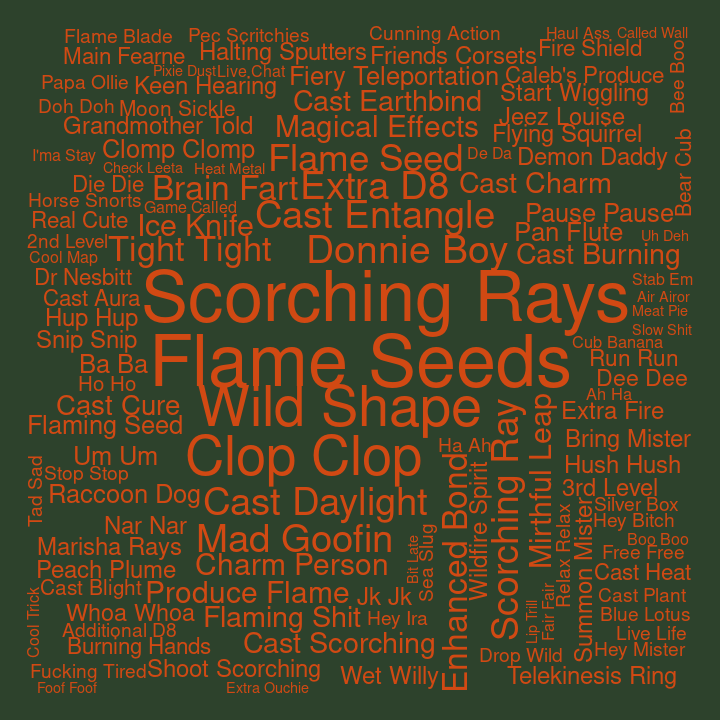

## Bigrams for C3

Pairs of words, bigrams, were analyzed. Bigrams containing stopwords or
digits were dropped, and bigrams were ranked by how unique they were to
each cast member, using tf-idf.

#### Ashley

| rank | bigram           |
| ---: | :--------------- |
|    1 | scorching rays   |
|    2 | flame seeds      |
|    3 | wild shape       |
|    4 | flame seed       |
|    5 | cast burning     |
|    6 | um um            |
|    7 | cast entangle    |
|    8 | flying squirrel  |
|    9 | grandmother told |
|   10 | hey mister       |

#### Laura

| rank | bigram            |
| ---: | :---------------- |
|    1 | dancing lights    |
|    2 | dig dig           |
|    3 | telekinetic shove |
|    4 | lightning bolt    |
|    5 | mage armor        |
|    6 | witch bolt        |
|    7 | flash white       |
|    8 | cast detect       |
|    9 | laura laura       |
|   10 | shit balls        |

#### Liam

| rank | bigram          |
| ---: | :-------------- |
|    1 | superiority die |
|    2 | action surge    |
|    3 | goading attack  |
|    4 | ay ay           |
|    5 | doodle doodle   |
|    6 | running start   |
|    7 | toy sword       |
|    8 | gunk gunk       |
|    9 | orym steps      |
|   10 | toy swords      |

#### Marisha

| rank | bigram              |
| ---: | :------------------ |
|    1 | creepy whispering   |
|    2 | eldritch blast      |
|    3 | unsettling presence |
|    4 | demonic whispers    |
|    5 | dream journal       |
|    6 | rock chisel         |
|    7 | cast bane           |
|    8 | beam beam           |
|    9 | roll ability        |
|   10 | temporary hit       |

#### Matt

| rank | bigram              |
| ---: | :------------------ |
|    1 | persuasion check    |
|    2 | roll damage         |
|    3 | dexterity saving    |
|    4 | acrobatics check    |
|    5 | piercing damage     |
|    6 | hellcatch valley    |
|    7 | bludgeoning damage  |
|    8 | investigation check |
|    9 | leans forward       |
|   10 | stealth check       |

#### Sam

| rank | bigram              |
| ---: | :------------------ |
|    1 | healing word        |
|    2 | smiley day          |
|    3 | temporary hit       |
|    4 | cure wounds         |
|    5 | sympathetic binding |
|    6 | cast identify       |
|    7 | robot voice         |
|    8 | bolt thrower        |
|    9 | cast cure           |
|   10 | enhance ability     |

#### Taliesin

| rank | bigram          |
| ---: | :-------------- |
|    1 | chaos burst     |
|    2 | fuck’s sake     |
|    3 | fuck’s sakes    |
|    4 | reckless attack |
|    5 | funny feeling   |
|    6 | fucking hard    |
|    7 | fucking rage    |
|    8 | weird fucking   |
|    9 | shit fuck       |
|   10 | fucking people  |

#### Travis

| rank | bigram             |
| ---: | :----------------- |
|    1 | wood chisel        |
|    2 | crimson rite       |
|    3 | climbing equipment |
|    4 | smoking bottle     |
|    5 | wood chips         |
|    6 | hunter’s bane      |
|    7 | quick footsteps    |
|    8 | slashing damage    |
|    9 | bertrand’s bells   |
|   10 | bitch laughter     |
