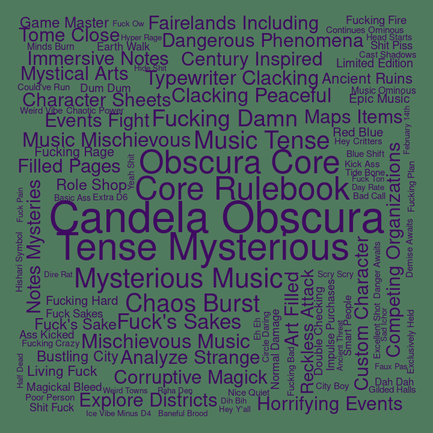

## Bigrams for C3

Pairs of words, bigrams, were analyzed. Bigrams containing stopwords or
digits were dropped, and bigrams were ranked by how unique they were to
each cast member, using tf-idf.

#### Ashley

| rank | bigram          |
| ---: | :-------------- |
|    1 | cast burning    |
|    2 | flame seed      |
|    3 | burning hands   |
|    4 | wild shape      |
|    5 | wildfire spirit |
|    6 | hey mister      |
|    7 | scorching rays  |
|    8 | flame blade     |
|    9 | ice knife       |
|   10 | ah ha           |

#### Laura

| rank | bigram            |
| ---: | :---------------- |
|    1 | dancing lights    |
|    2 | lightning damage  |
|    3 | telekinetic shove |
|    4 | witch bolt        |
|    5 | laura laura       |
|    6 | mage armor        |
|    7 | cast detect       |
|    8 | neat trick        |
|    9 | misty step        |
|   10 | flash white       |

#### Liam

| rank | bigram             |
| ---: | :----------------- |
|    1 | superiority die    |
|    2 | action surge       |
|    3 | goading attack     |
|    4 | doodle doodle      |
|    5 | running start      |
|    6 | strength save      |
|    7 | gunk gunk          |
|    8 | real low           |
|    9 | tug tug            |
|   10 | deeply appreciated |

#### Marisha

| rank | bigram              |
| ---: | :------------------ |
|    1 | creepy whispering   |
|    2 | eldritch blast      |
|    3 | yep yep             |
|    4 | fuck fuck           |
|    5 | unsettling presence |
|    6 | rock chisel         |
|    7 | uh huh              |
|    8 | temporary hit       |
|    9 | wisdom saving       |
|   10 | la la               |

#### Matt

| rank | bigram              |
| ---: | :------------------ |
|    1 | roll damage         |
|    2 | persuasion check    |
|    3 | dexterity saving    |
|    4 | perception check    |
|    5 | investigation check |
|    6 | stealth check       |
|    7 | piercing damage     |
|    8 | bludgeoning damage  |
|    9 | deception check     |
|   10 | fire damage         |

#### Robbie

| rank | bigram             |
| ---: | :----------------- |
|    1 | beep boop          |
|    2 | boing boing        |
|    3 | broad term         |
|    4 | cast invisibility  |
|    5 | rhythm section     |
|    6 | tracking ring      |
|    7 | cast level         |
|    8 | moon touched       |
|    9 | touched scimitar   |
|   10 | bardic inspiration |

#### Sam

| rank | bigram          |
| ---: | :-------------- |
|    1 | healing word    |
|    2 | smiley day      |
|    3 | enhance ability |
|    4 | robot voice     |
|    5 | nice nice       |
|    6 | temporary hit   |
|    7 | shiny day       |
|    8 | tight tight     |
|    9 | cast guidance   |
|   10 | sacred flame    |

#### Taliesin

| rank | bigram           |
| ---: | :--------------- |
|    1 | chaos burst      |
|    2 | fuck’s sake      |
|    3 | reckless attack  |
|    4 | fuck’s sakes     |
|    5 | weird fucking    |
|    6 | fucking hard     |
|    7 | normal damage    |
|    8 | yep yep          |
|    9 | lightning damage |
|   10 | temporal morass  |

#### Travis

| rank | bigram            |
| ---: | :---------------- |
|    1 | wood chisel       |
|    2 | quick footsteps   |
|    3 | bertrand’s bells  |
|    4 | tight quarters    |
|    5 | yesterday morning |
|    6 | fart sound        |
|    7 | yeah baby         |
|    8 | emoth kade        |
|    9 | chanting level    |
|   10 | gambler’s blade   |
