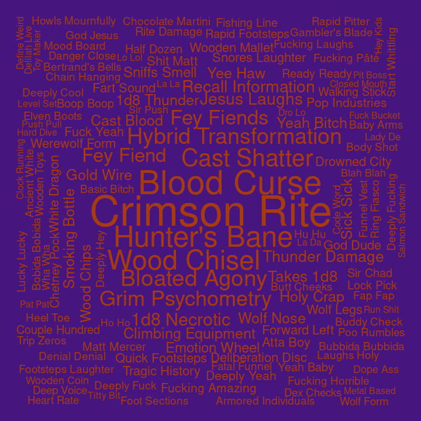

## Bigrams for C3

Pairs of words, bigrams, were analyzed. Bigrams containing stopwords or
digits were dropped, and bigrams were ranked by how unique they were to
each cast member, using tf-idf.

#### Ashley

| rank | bigram          |
| ---: | :-------------- |
|    1 | cast burning    |
|    2 | burning hands   |
|    3 | wild shape      |
|    4 | wildfire spirit |
|    5 | flame blade     |
|    6 | flame seed      |
|    7 | ah ha           |
|    8 | cast charm      |
|    9 | ice knife       |
|   10 | jeez louise     |

#### Laura

| rank | bigram              |
| ---: | :------------------ |
|    1 | laura laura         |
|    2 | witch bolt          |
|    3 | cast witch          |
|    4 | telekinetic shove   |
|    5 | cast detect         |
|    6 | mage armor          |
|    7 | misty step          |
|    8 | intelligence saving |
|    9 | madam zhudanna      |
|   10 | multiple people     |

#### Liam

| rank | bigram             |
| ---: | :----------------- |
|    1 | action surge       |
|    2 | superiority die    |
|    3 | goading attack     |
|    4 | doodle doodle      |
|    5 | running start      |
|    6 | strength save      |
|    7 | gunk gunk          |
|    8 | tug tug            |
|    9 | deeply appreciated |
|   10 | jingle jingle      |

#### Marisha

| rank | bigram              |
| ---: | :------------------ |
|    1 | eldritch blast      |
|    2 | creepy whispering   |
|    3 | unsettling presence |
|    4 | dead woman          |
|    5 | rock chisel         |
|    6 | fuck fuck           |
|    7 | la la               |
|    8 | temporary hit       |
|    9 | wisdom saving       |
|   10 | uh huh              |

#### Matt

| rank | bigram              |
| ---: | :------------------ |
|    1 | persuasion check    |
|    2 | roll damage         |
|    3 | perception check    |
|    4 | dexterity saving    |
|    5 | investigation check |
|    6 | stealth check       |
|    7 | bludgeoning damage  |
|    8 | deception check     |
|    9 | fire damage         |
|   10 | piercing damage     |

#### Robbie

| rank | bigram            |
| ---: | :---------------- |
|    1 | cure wounds       |
|    2 | beep boop         |
|    3 | boing boing       |
|    4 | broad term        |
|    5 | cast invisibility |
|    6 | rhythm section    |
|    7 | tracking ring     |
|    8 | cast level        |
|    9 | moon touched      |
|   10 | touched scimitar  |

#### Sam

| rank | bigram          |
| ---: | :-------------- |
|    1 | smiley day      |
|    2 | enhance ability |
|    3 | robot voice     |
|    4 | healing word    |
|    5 | nice nice       |
|    6 | temporary hit   |
|    7 | cast guidance   |
|    8 | shiny day       |
|    9 | cast detect     |
|   10 | animal shit     |

#### Taliesin

| rank | bigram           |
| ---: | :--------------- |
|    1 | chaos burst      |
|    2 | reckless attack  |
|    3 | fuck’s sake      |
|    4 | yep yep          |
|    5 | weird fucking    |
|    6 | normal damage    |
|    7 | lightning damage |
|    8 | ass kicked       |
|    9 | could’ve hoped   |
|   10 | earth genasi     |

#### Travis

| rank | bigram            |
| ---: | :---------------- |
|    1 | wood chisel       |
|    2 | bertrand’s bells  |
|    3 | tight quarters    |
|    4 | yesterday morning |
|    5 | low profile       |
|    6 | yeah baby         |
|    7 | lady emoth        |
|    8 | quick footsteps   |
|    9 | emoth kade        |
|   10 | chanting level    |
