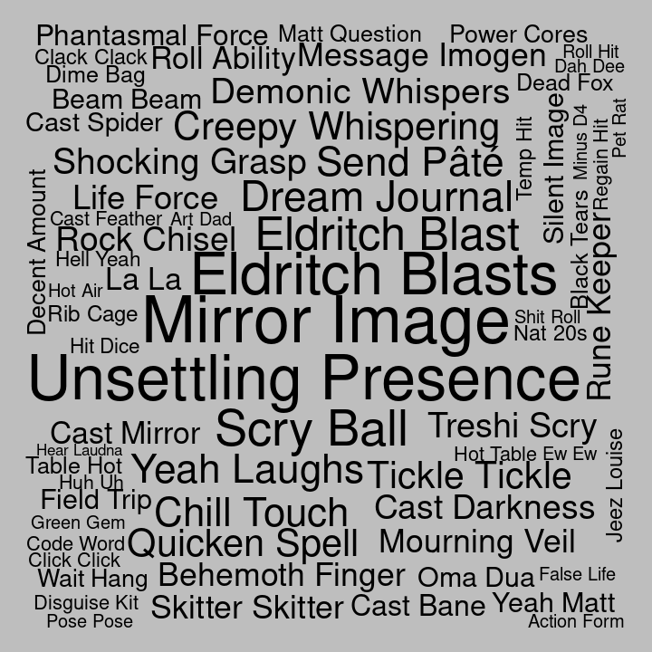

## Bigrams for C3

Pairs of words, bigrams, were analyzed. Bigrams containing stopwords or
digits were dropped, and bigrams were ranked by how unique they were to
each cast member, using tf-idf.

#### Ashley

| rank | bigram         |
| ---: | :------------- |
|    1 | flame seeds    |
|    2 | ice knife      |
|    3 | scorching rays |
|    4 | flame seed     |
|    5 | moon sickle    |
|    6 | wild shape     |
|    7 | cast burning   |
|    8 | mirthful leap  |
|    9 | um um          |
|   10 | whoa whoa      |

#### Laura

| rank | bigram            |
| ---: | :---------------- |
|    1 | telekinetic shove |
|    2 | lightning bolt    |
|    3 | mage armor        |
|    4 | dancing lights    |
|    5 | dig dig           |
|    6 | cast detect       |
|    7 | eep eep           |
|    8 | flash white       |
|    9 | cast fly          |
|   10 | misty step        |

#### Liam

| rank | bigram           |
| ---: | :--------------- |
|    1 | superiority die  |
|    2 | action surge     |
|    3 | goading attack   |
|    4 | running start    |
|    5 | lord de          |
|    6 | ay ay            |
|    7 | disarming attack |
|    8 | doodle doodle    |
|    9 | orym steps       |
|   10 | toy sword        |

#### Marisha

| rank | bigram              |
| ---: | :------------------ |
|    1 | creepy whispering   |
|    2 | demonic whispers    |
|    3 | eldritch blast      |
|    4 | unsettling presence |
|    5 | dream journal       |
|    6 | rock chisel         |
|    7 | beam beam           |
|    8 | hot table           |
|    9 | roll ability        |
|   10 | rune keeper         |

#### Matt

| rank | bigram             |
| ---: | :----------------- |
|    1 | persuasion check   |
|    2 | acrobatics check   |
|    3 | roll damage        |
|    4 | piercing damage    |
|    5 | push past          |
|    6 | bludgeoning damage |
|    7 | dexterity saving   |
|    8 | short time         |
|    9 | leans forward      |
|   10 | move past          |

#### Sam

| rank | bigram              |
| ---: | :------------------ |
|    1 | healing word        |
|    2 | cure wounds         |
|    3 | bow bow             |
|    4 | spiritual weapon    |
|    5 | sympathetic binding |
|    6 | temporary hit       |
|    7 | dun dun             |
|    8 | bolt thrower        |
|    9 | enhance ability     |
|   10 | bonded blessing     |

#### Taliesin

| rank | bigram          |
| ---: | :-------------- |
|    1 | chaos burst     |
|    2 | fuck’s sake     |
|    3 | fuck’s sakes    |
|    4 | reckless attack |
|    5 | god fucking     |
|    6 | funny feeling   |
|    7 | fucking damn    |
|    8 | shit fuck       |
|    9 | fucking hard    |
|   10 | fucking rage    |

#### Travis

| rank | bigram             |
| ---: | :----------------- |
|    1 | wood chisel        |
|    2 | crimson rite       |
|    3 | hunter’s bane      |
|    4 | wood chips         |
|    5 | climbing equipment |
|    6 | gold wire          |
|    7 | sick sick          |
|    8 | smoking bottle     |
|    9 | bloated agony      |
|   10 | slashing damage    |
