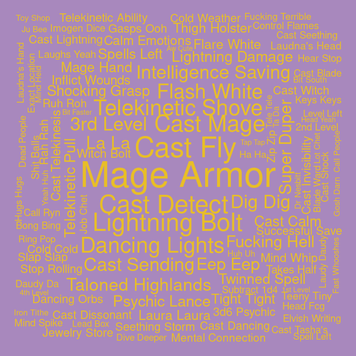

## Bigrams for C3

Pairs of words, bigrams, were analyzed. Bigrams containing stopwords or
digits were dropped, and bigrams were ranked by how unique they were to
each cast member, using tf-idf.

#### Ashley

| rank | bigram          |
| ---: | :-------------- |
|    1 | cast burning    |
|    2 | burning hands   |
|    3 | wild shape      |
|    4 | flame seed      |
|    5 | wildfire spirit |
|    6 | hey mister      |
|    7 | scorching rays  |
|    8 | flame blade     |
|    9 | ah ha           |
|   10 | cast charm      |

#### Laura

| rank | bigram            |
| ---: | :---------------- |
|    1 | laura laura       |
|    2 | lightning damage  |
|    3 | witch bolt        |
|    4 | dancing lights    |
|    5 | mage armor        |
|    6 | cast witch        |
|    7 | neat trick        |
|    8 | telekinetic shove |
|    9 | cast detect       |
|   10 | misty step        |

#### Liam

| rank | bigram             |
| ---: | :----------------- |
|    1 | superiority die    |
|    2 | action surge       |
|    3 | goading attack     |
|    4 | doodle doodle      |
|    5 | running start      |
|    6 | strength save      |
|    7 | gunk gunk          |
|    8 | tug tug            |
|    9 | deeply appreciated |
|   10 | feinting attack    |

#### Marisha

| rank | bigram              |
| ---: | :------------------ |
|    1 | eldritch blast      |
|    2 | creepy whispering   |
|    3 | unsettling presence |
|    4 | dead woman          |
|    5 | rock chisel         |
|    6 | fuck fuck           |
|    7 | la la               |
|    8 | temporary hit       |
|    9 | wisdom saving       |
|   10 | uh huh              |

#### Matt

| rank | bigram              |
| ---: | :------------------ |
|    1 | roll damage         |
|    2 | persuasion check    |
|    3 | dexterity saving    |
|    4 | perception check    |
|    5 | investigation check |
|    6 | stealth check       |
|    7 | deception check     |
|    8 | bludgeoning damage  |
|    9 | piercing damage     |
|   10 | fire damage         |

#### Robbie

| rank | bigram            |
| ---: | :---------------- |
|    1 | cure wounds       |
|    2 | beep boop         |
|    3 | boing boing       |
|    4 | broad term        |
|    5 | cast invisibility |
|    6 | rhythm section    |
|    7 | tracking ring     |
|    8 | cast level        |
|    9 | moon touched      |
|   10 | touched scimitar  |

#### Sam

| rank | bigram          |
| ---: | :-------------- |
|    1 | smiley day      |
|    2 | healing word    |
|    3 | enhance ability |
|    4 | robot voice     |
|    5 | temporary hit   |
|    6 | nice nice       |
|    7 | cast guidance   |
|    8 | shiny day       |
|    9 | cast detect     |
|   10 | 3rd level       |

#### Taliesin

| rank | bigram           |
| ---: | :--------------- |
|    1 | chaos burst      |
|    2 | fuck’s sake      |
|    3 | reckless attack  |
|    4 | fuck’s sakes     |
|    5 | weird fucking    |
|    6 | yep yep          |
|    7 | normal damage    |
|    8 | lightning damage |
|    9 | ass kicked       |
|   10 | could’ve hoped   |

#### Travis

| rank | bigram            |
| ---: | :---------------- |
|    1 | wood chisel       |
|    2 | quick footsteps   |
|    3 | bertrand’s bells  |
|    4 | tight quarters    |
|    5 | yesterday morning |
|    6 | yeah baby         |
|    7 | emoth kade        |
|    8 | chanting level    |
|    9 | fart sound        |
|   10 | gambler’s blade   |
