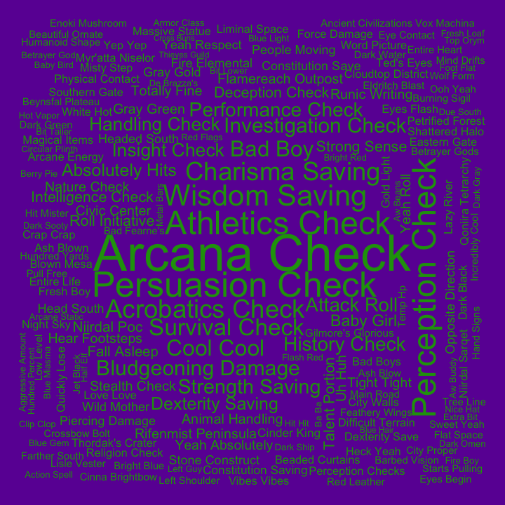
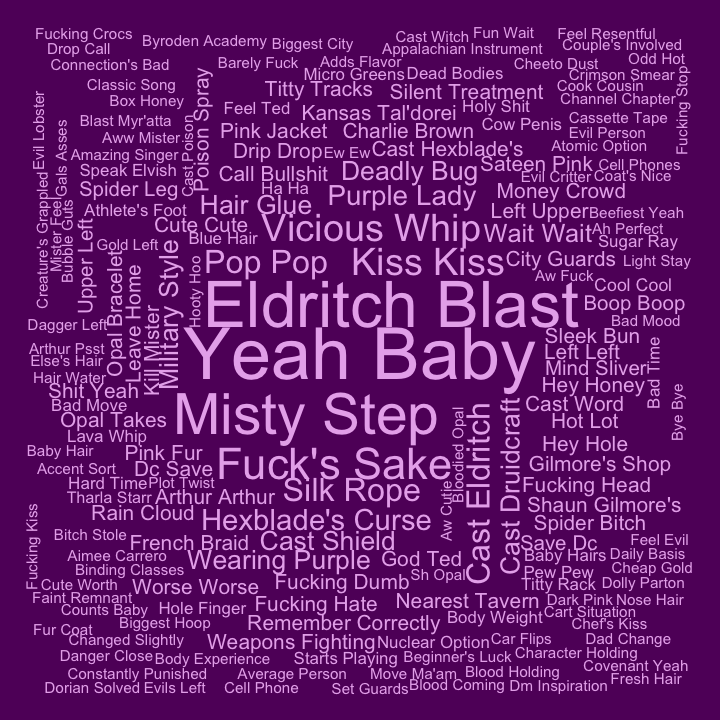
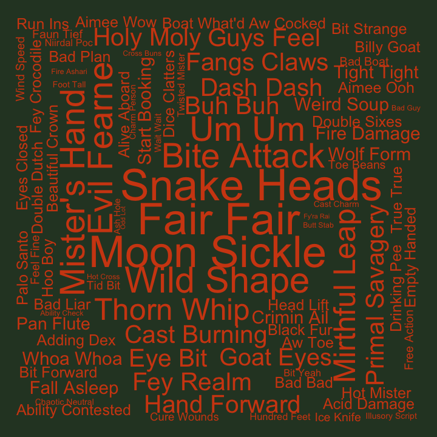
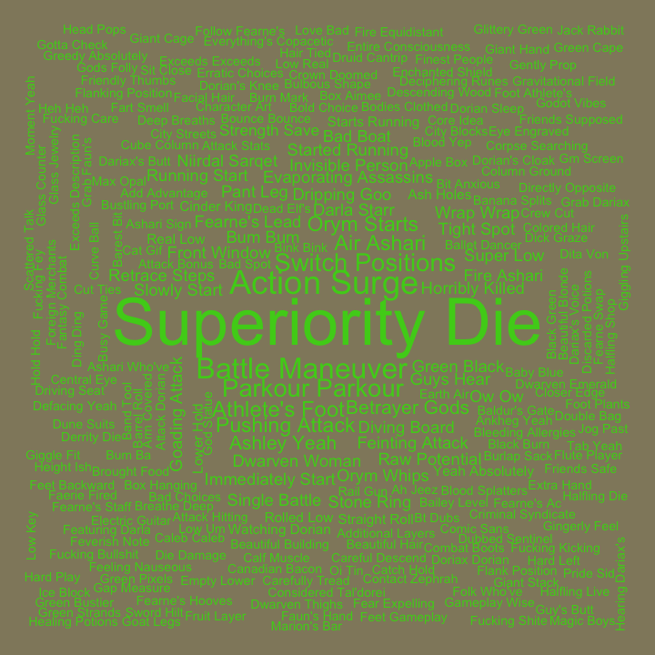
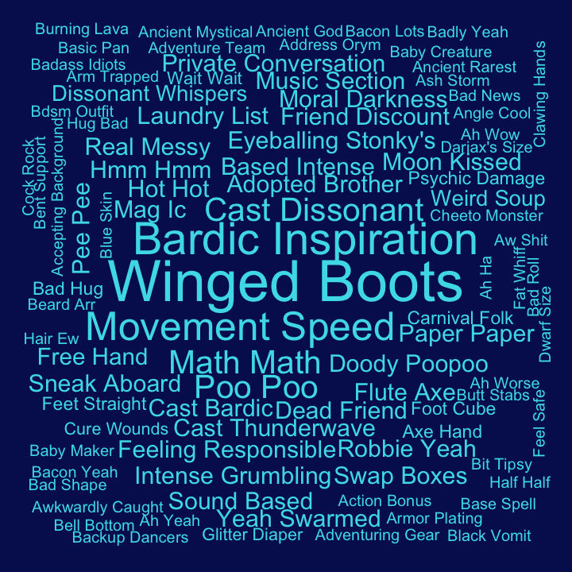

## Bigrams for Exandria Unlimited

Pairs of words, bigrams, were analyzed. Bigrams containing stopwords or
digits were dropped, and bigrams were ranked by how unique they were to
each cast member, using tf-idf.

#### Aabria

| rank | bigram           |
|-----:|:-----------------|
|    1 | arcana check     |
|    2 | persuasion check |
|    3 | perception check |
|    4 | athletics check  |
|    5 | wisdom saving    |
|    6 | acrobatics check |
|    7 | charisma saving  |
|    8 | survival check   |
|    9 | cool cool        |
|   10 | bad boy          |

#### Aimee

| rank | bigram           |
|-----:|:-----------------|
|    1 | yeah baby        |
|    2 | eldritch blast   |
|    3 | misty step       |
|    4 | fuck’s sake      |
|    5 | kiss kiss        |
|    6 | vicious whip     |
|    7 | cast eldritch    |
|    8 | pop pop          |
|    9 | silk rope        |
|   10 | hexblade’s curse |

#### Ashley

| rank | bigram        |
|-----:|:--------------|
|    1 | fair fair     |
|    2 | moon sickle   |
|    3 | snake heads   |
|    4 | wild shape    |
|    5 | bite attack   |
|    6 | evil fearne   |
|    7 | mister’s hand |
|    8 | um um         |
|    9 | mirthful leap |
|   10 | thorn whip    |

#### Liam

| rank | bigram           |
|-----:|:-----------------|
|    1 | superiority die  |
|    2 | action surge     |
|    3 | battle maneuver  |
|    4 | parkour parkour  |
|    5 | switch positions |
|    6 | athlete’s foot   |
|    7 | air ashari       |
|    8 | orym starts      |
|    9 | pushing attack   |
|   10 | ashley yeah      |

#### Matt

| rank | bigram           |
|-----:|:-----------------|
|    1 | hell yeah        |
|    2 | compass rose     |
|    3 | fucking cool     |
|    4 | hey hey          |
|    5 | cast bless       |
|    6 | paying attention |
|    7 | saving throws    |
|    8 | bad people       |
|    9 | boom boom        |
|   10 | cast thaumaturgy |

#### Robbie

| rank | bigram             |
|-----:|:-------------------|
|    1 | winged boots       |
|    2 | bardic inspiration |
|    3 | movement speed     |
|    4 | cast dissonant     |
|    5 | math math          |
|    6 | poo poo            |
|    7 | adopted brother    |
|    8 | based intense      |
|    9 | cast bardic        |
|   10 | cast thunderwave   |
