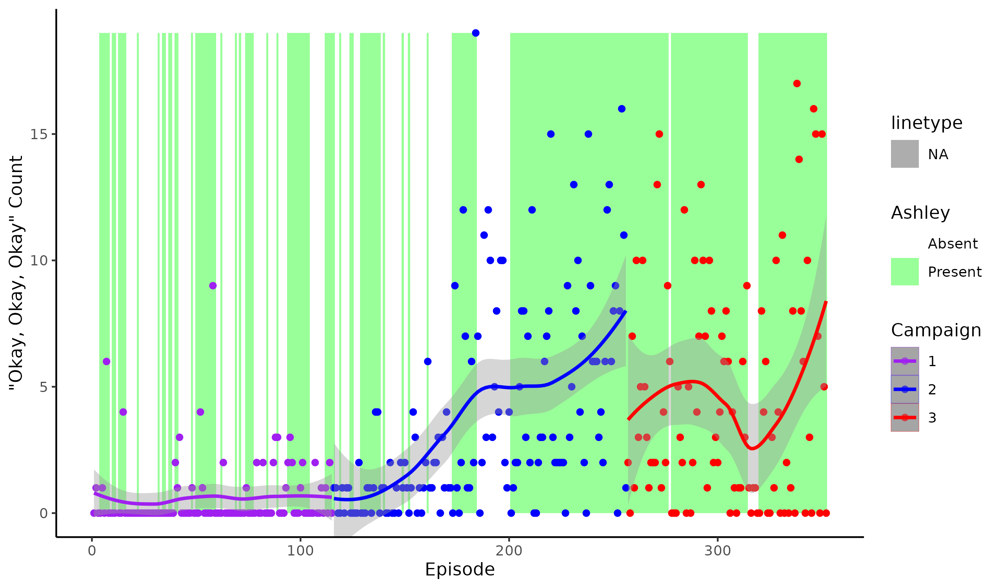

## “Okay, Okay, Okay”: Who said it and When?

“Okay, Okay, Okay” has been said a lot over the two campaigns of
Critical Role. Looking just at the main campaign episodes, and only
during gameplay, it has been said 615 times to be exact\! It is most
associated with Ashley, but does she say it the most? And has the
frequency with which it is said changed over the campaigns?

#### Who says “Okay, Okay, Okay” the most?

| name     | count | attended |     words | per episode | per word | one in every n words |
| :------- | ----: | -------: | --------: | ----------: | -------: | -------------------: |
| Ashley   |    97 |      146 |   149,731 |        0.66 | 0.001943 |                  515 |
| Laura    |   249 |      251 |   723,474 |        0.99 | 0.001033 |                  969 |
| Marisha  |   171 |      259 |   577,604 |        0.66 | 0.000888 |                1,126 |
| Sam      |    54 |      252 |   570,503 |        0.21 | 0.000284 |                3,522 |
| Travis   |    17 |      248 |   514,621 |        0.07 | 0.000099 |               10,091 |
| Liam     |    17 |      257 |   590,754 |        0.07 | 0.000086 |               11,583 |
| Taliesin |     3 |      256 |   540,633 |        0.01 | 0.000017 |               60,070 |
| Matt     |     7 |      261 | 3,197,288 |        0.03 | 0.000007 |              152,252 |

It turns out that both Laura (249) and Marisha (171) have said “Okay,
Okay, Okay” more times than Ashley (97). However, they both were present
for more episodes, and have said many more words than Ashley. If we look
at how many times they said it per episode they were in, Laura still
comes out on top, averaging 0.992 “Okay, Okay, Okay”s per episode, with
Marisha and Ashley averaging 0.66 and 0.664 respectively. But if we look
at the total number of words they said, we see that Ashley (149,731)
said fewer words than either Laura (723,474) or Marisha (577,604).
Taking this into account, we find that 1 in every 515 words that Ashley
said was part of “Okay, Okay, Okay”, compared to 1 in every 969 for
Laura, and 1 in every 1126 for Marisha. So while Ashley may not have
said it the most, she did have the highest frequency of “Okay, Okay,
Okay” in her dialogue.

Another interesting point is that if we compare the number of times per
episode “Okay, Okay, Okay” is said when Ashley is present versus when
she is absent, we see that “Okay, Okay, Okay” is said an average of 3.14
times per episode when Ashley is there, and only 1.37 times per episode
when she is absent. This is an average increase of 1.77 times per
episode when Ashley is present, but Ashley herself only averages 0.664
“Okay, Okay, Okay”s per episode. This suggests that having Ashley at
the table results in the other cast members saying “Okay, Okay, Okay”
more often\! And a Wilcoxon rank sum test confirms that “Okay, Okay,
Okay” is said at a statistically significant higher rate when Ashley is
present (*p* = 0.000128). However, as shown in the next section, it is
difficult to untangle this from the change in the frequency of “Okay,
Okay, Okay” over the two campaigns, and Ashley’s more frequent presence
in the later episodes of campaign 2.

#### Has the use of “Okay, Okay, Okay” changed over time?

We see in the figure that “Okay, Okay, Okay” was said at a fairly low
rate during campaign 1, and didn’t change much from start to finish.
Campaign 2, however, started at about the same rate campaign 1 ended at,
but increased substantially as it progressed. The most times “Okay,
Okay, Okay” was said during an episode was campaign 2 episode 69, when
it was said 19 times.
