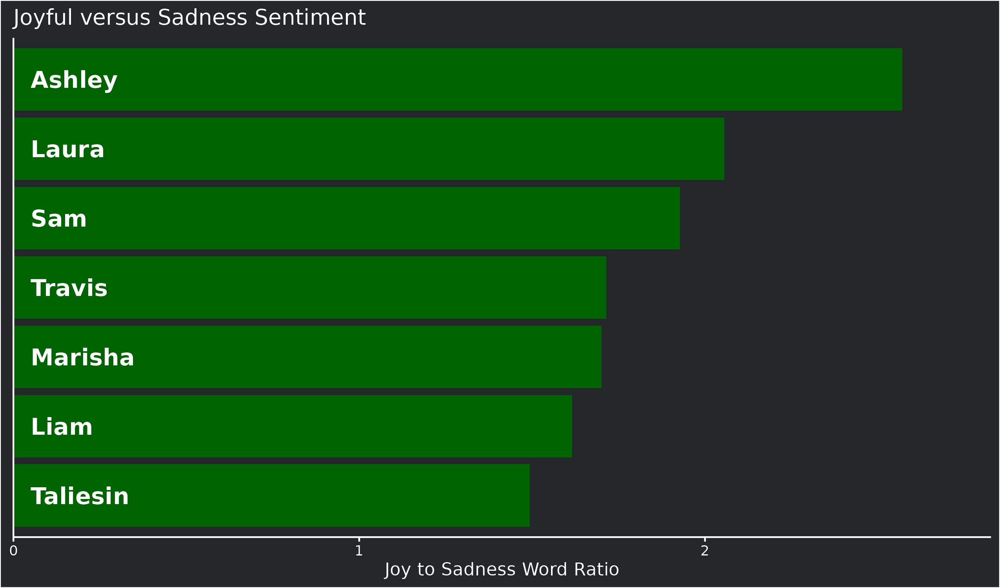

### Does Liam play the saddest bois? A word sentiment analysis of cast dialogue

Liam has a reputation for playing sad characters, but is this deserved?
Does his dialogue contain more sad words than the rest of the cast?

To answer this I searched the dialogue from the show for words
associated with a sad sentiment, and words associated with joy as a
control. I then calculated the ratio of joyful to sad words for each
cast member and plotted it.

| Name     |   Joy | Sadness | Ratio |
| :------- | ----: | ------: | ----: |
| Ashley   |  3859 |    1711 |  2.26 |
| Robbie   |   628 |     282 |  2.23 |
| Laura    | 15536 |    7634 |  2.04 |
| Sam      | 13066 |    7188 |  1.82 |
| Marisha  | 11535 |    6979 |  1.65 |
| Travis   | 11078 |    6770 |  1.64 |
| Liam     |  9847 |    6188 |  1.59 |
| Taliesin | 11084 |    7552 |  1.47 |

We can see that while Liam is in the bottom half, both Travis and
Taliesin have lower scores.

I also wanted to take a slightly different approach and look at for
words with either a positive or negative sentiment.

| Name     | Negative | Positive | Ratio |
| :------- | -------: | -------: | ----: |
| Laura    |    19618 |    33610 |  1.71 |
| Ashley   |     4455 |     7410 |  1.66 |
| Robbie   |      798 |     1327 |  1.66 |
| Sam      |    16716 |    26031 |  1.56 |
| Taliesin |    16536 |    24474 |  1.48 |
| Liam     |    16043 |    21732 |  1.35 |
| Marisha  |    19861 |    26003 |  1.31 |
| Travis   |    18757 |    24140 |  1.29 |

Again Liam is near the bottom, but Travis still has a lower score.

-----

### References for lexicons

Hu, M., & Liu, B. (2004). Mining and summarizing customer reviews.
Proceedings of the 2004 ACM SIGKDD International Conference on Knowledge
Discovery and Data Mining - KDD ’04, 168.
<https://doi.org/10.1145/1014052.1014073>

Mohammad, S. M., & Turney, P. D. (2013). Crowdsourcing a Word–Emotion
Association Lexicon. Computational Intelligence, 29(3), 436–465.
<https://doi.org/10.1111/j.1467-8640.2012.00460.x>

Nielsen, F. Å. (2011). A new ANEW: Evaluation of a word list for
sentiment analysis in microblogs. ArXiv:1103.2903 \[Cs\].
<http://arxiv.org/abs/1103.2903>
