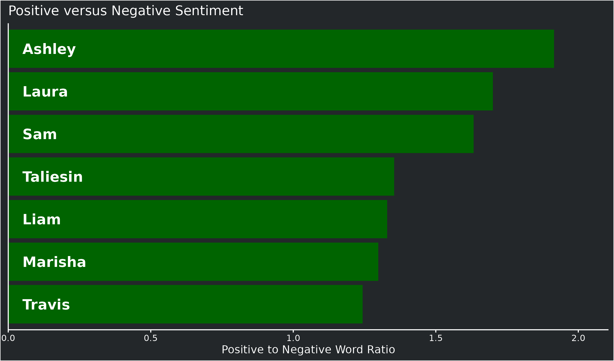

### Does Liam play the saddest bois? A word sentiment analysis of cast dialogue

Liam has a reputation for playing sad characters, but is this deserved?
Does his dialogue contain more sad words than the rest of the cast?

To answer this I searched the dialogue from the show for words
associated with a sad sentiment, and words associated with joy as a
control. I then calculated the ratio of joyful to sad words for each
cast member and plotted it.

| Name     |   Joy | Sadness | Ratio |
|:---------|------:|--------:|------:|
| Ashley   |  2569 |    1233 |  2.08 |
| Laura    | 12881 |    6621 |  1.95 |
| Sam      | 10781 |    6096 |  1.77 |
| Marisha  |  9458 |    5795 |  1.63 |
| Liam     |  7887 |    5019 |  1.57 |
| Travis   |  8815 |    5752 |  1.53 |
| Taliesin |  9027 |    6450 |  1.40 |

We can see that while Liam is in the bottom half, both Travis and
Taliesin have lower scores.

I also wanted to take a slightly different approach and look at for
words with either a positive or negative sentiment.

| Name     | Negative | Positive | Ratio |
|:---------|---------:|---------:|------:|
| Laura    |    16760 |    27816 |  1.66 |
| Ashley   |     3169 |     5092 |  1.61 |
| Sam      |    13886 |    21083 |  1.52 |
| Taliesin |    13239 |    19715 |  1.49 |
| Liam     |    13097 |    17490 |  1.34 |
| Marisha  |    16248 |    21184 |  1.30 |
| Travis   |    15517 |    19692 |  1.27 |

Again Liam is near the bottom, but Travis still has a lower score.
