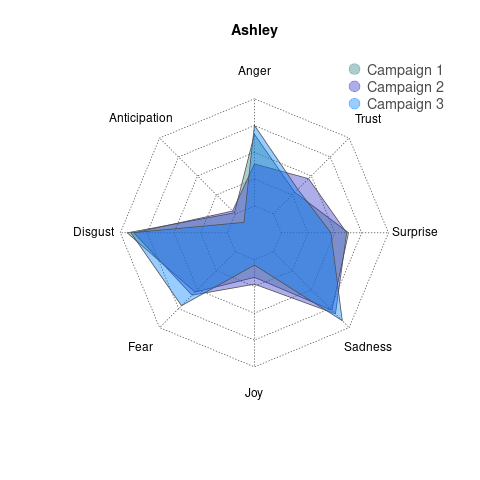
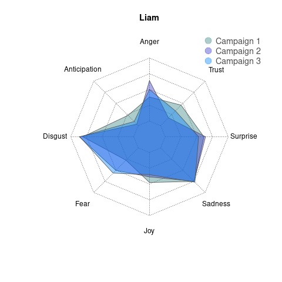
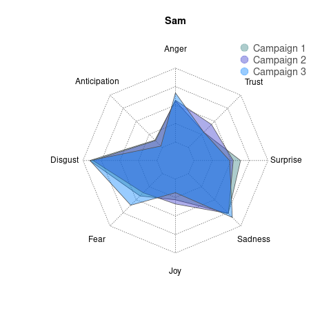
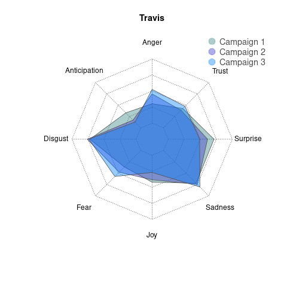

### How does the use of emotional words change between campaigns?

This analysis looks at the use of words associated with emotional sentiments and compares their use between campaigns.

For each cast member, the frequency each category of emotional sentiment appears in their dialogue during game play is compared to their overall use of emotional sentiments. This is then compared between the two campaigns.

#### Overall

#### Ashley

#### Laura

#### Liam

#### Marisha

#### Matt

#### Sam

#### Taliesin

#### Travis
