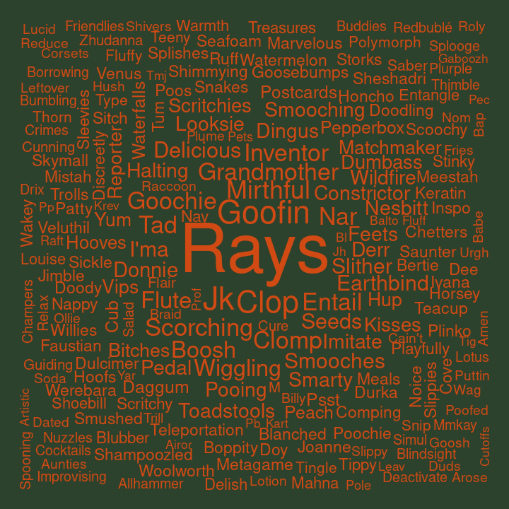
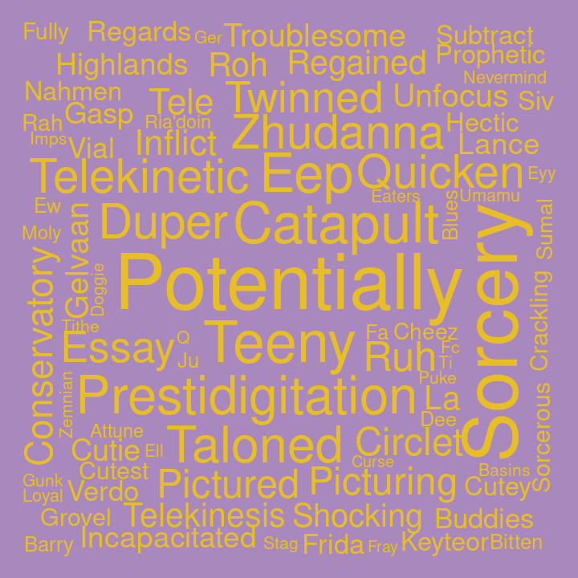
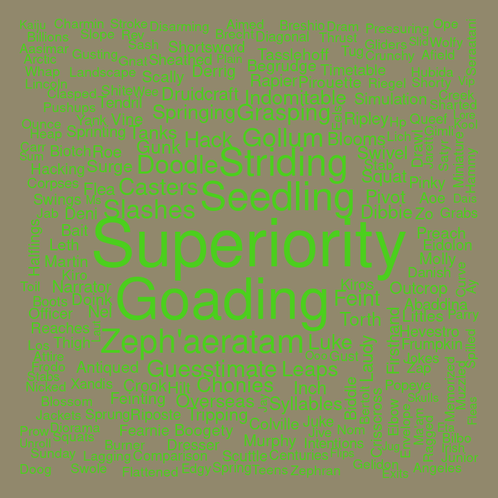
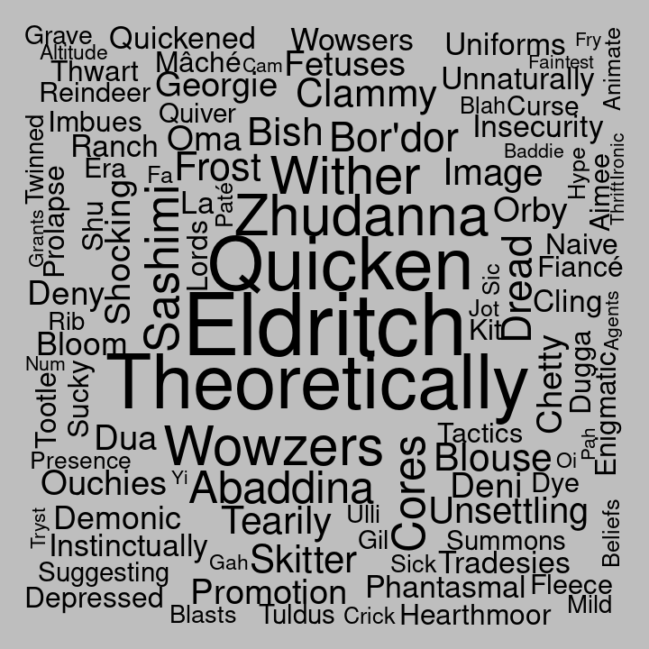
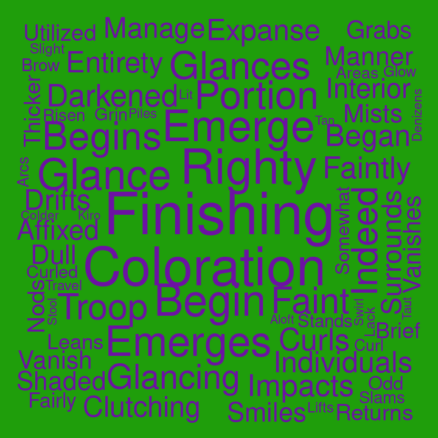
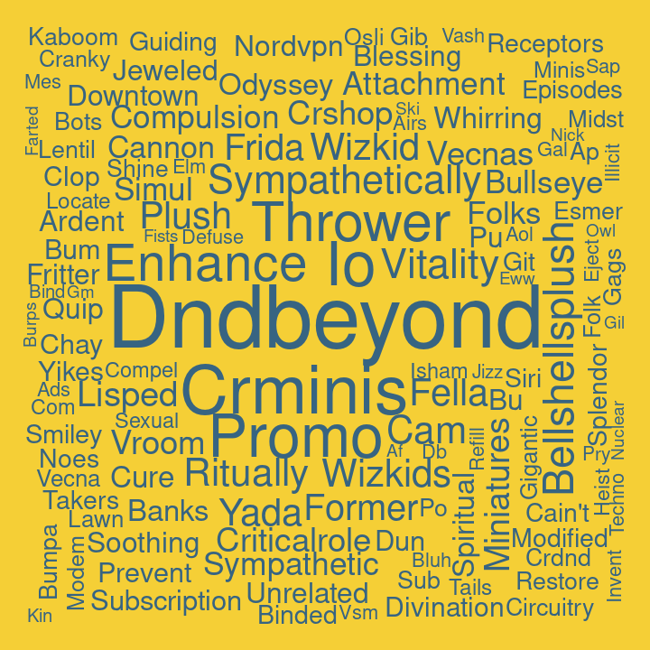
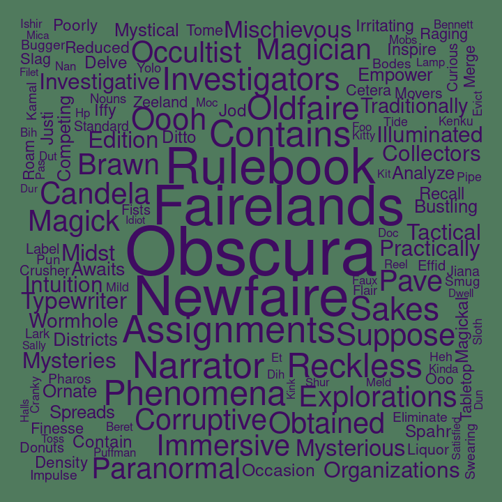
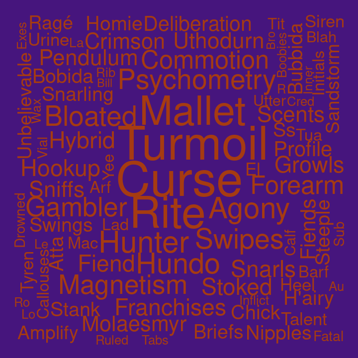

### Word Clouds for Campaign 3

This analysis compares the frequency words are used by each cast member
and compares that to the frequency the word is used by the whole cast to
determine how unique words are to each cast member. The more unique a
word is to the cast member the larger it will appear in their word
cloud. Only dialogue from game play of the main campaign episodes was
included.

#### Ashley

#### Laura

#### Liam

#### Marisha

#### Matt

#### Sam

#### Taliesin

#### Travis

#### Fun facts

  - So far, over 3.39 million words have been spoken during Campaign 3
