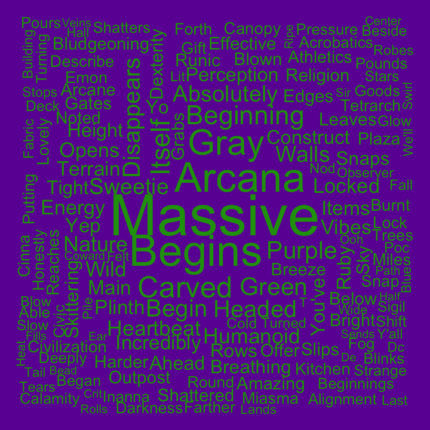
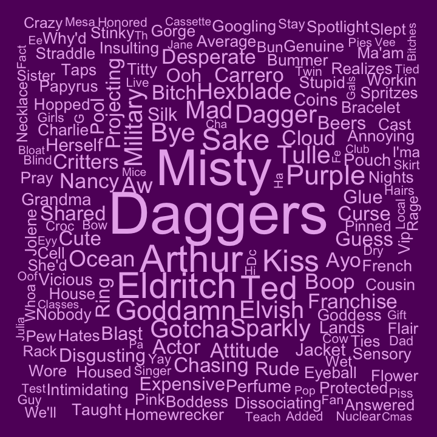
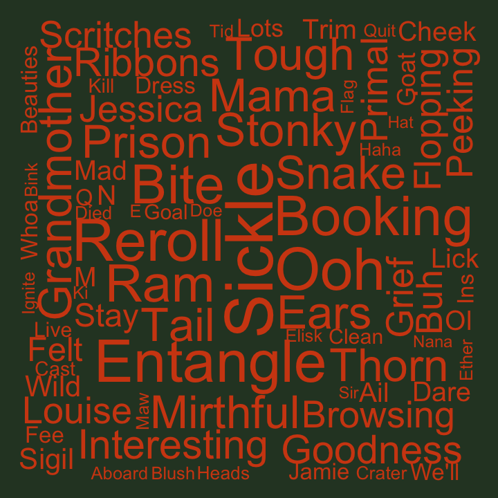
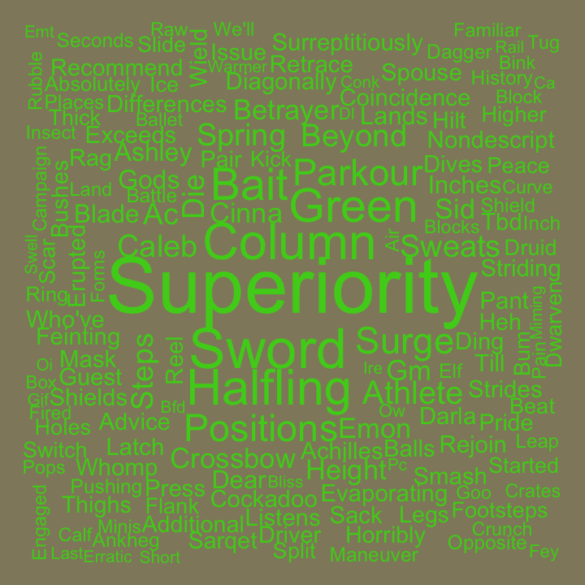
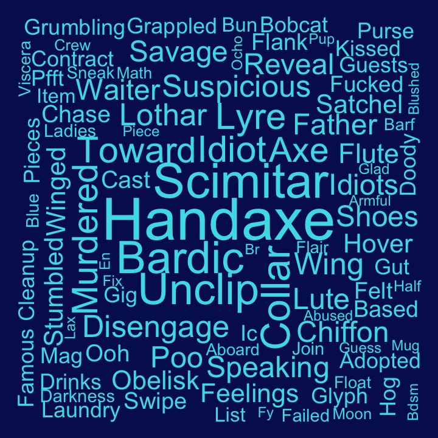

### Word Clouds for Exandria Unlimited

This analysis compares the frequency words are used by each cast member and compares that to the frequency the word is used by the whole cast to determine how unique words are to each cast member. The more unique a word is to the cast member the larger it will appear in their word cloud. Only dialogue from game play time was included.

#### Aabria

#### Aimee

#### Ashley

#### Liam

#### Matt

#### Robbie

#### Fun facts

* 254,715 words were spoken during Exandria Unlimited!

During game play of Exandria Unlimited:
* Aabria said the most words at 117,713, including 'massive' 98 times and 'begins' 71 times
* Aimee said 'dagger' 18 times and 'Ted' 74 times
* Ashley said the fewest words at 18,698; but said 'ooh' 44 times and 'okay' 471 times
* Liam said 'superiority' and 'sword' 15 times each
* Matt said 'righty' 25 times and 'ahead' 79 times
* Robbie said 'scimitar' 13 times and 'axe' or 'handaxe' 20 times
